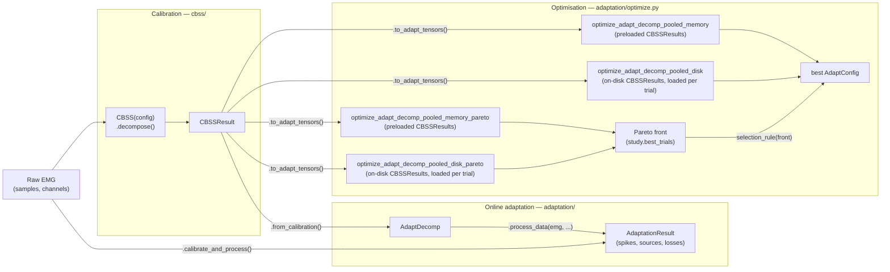

# Adaptive EMG decomposition in dynamic conditions based on online learning metrics with tunable hyperparameters

This repository contains functions to adaptively decompose electromyography (EMG) into motor unit firings during dynamic conditions in real-time (~22 ms per 100 ms batch, CPU only with loss calculation) based on online learning metrics with tunable hyperparameters as described in [Mendez Guerra et al, JNE, 2024](https://dx.doi.org/10.1088/1741-2552/ad5ebf). The code is implemented in Python using PyTorch.

The full pipeline is as follows including calibration, hyperparameter optimisation, and adaptation:



## Table of Contents
- [Installation](#installation)
- [Dcomumentation](#Dcomumentation)
- [Tutorial](#tutorial)
- [FDSI Benchmark](#fdsi-benchmark)
- [Contributing](#contributing)
- [License](#license)
- [Citation](#citation)
- [Contact](#contact)

## Installation
To set up the project locally do the following:

1. Clone the repository:
    ```sh
    git clone https://github.com/imendezguerra/adapt_decomp.git
    ```
2. Navigate to the project directory:
    ```sh
    cd adapt_decomp
    ```
3. Create the conda environment from the `environment.lock.yaml` file:
    ```sh
    conda env create -f environment.lock.yaml
    ```
4. Activate the environment:
    ```sh
    conda activate adapt_decomp
    ```
5. Install the package:
    ```sh
    pip install -e .
    ```

Please note that `environment.lock.yaml` only installs the `cpu` version of `pytorch`. To enable GPU acceleration, `cuda` will need to be installed manually (check command [here](https://pytorch.org/get-started/locally/)).

The code has been tested on macOS, Windows, and Linux.

## Documentation

A task-oriented manual for each entry point, with diagrams of how the
pieces connect.

| Page | Covers |
|------|--------|
| [docs/architecture.md](docs/architecture.md) | Repo layout, subpackage dependencies, how objects hand off between stages |
| [docs/calibration.md](docs/calibration.md) | `cbss/`: running CBSS on raw EMG, loading/reusing an existing calibration |
| [docs/adaptation.md](docs/adaptation.md) | `adaptation/`: the three ways to build an `AdaptDecomp` and run it |
| [docs/optimisation.md](docs/optimisation.md) | `adaptation/optimize.py`: single-contraction and pooled hyperparameter search — single-objective (`objective`) and Pareto/multi-objective (`objectives`) |

### Where to start

- **Have raw EMG, need motor units:** [docs/calibration.md](docs/calibration.md).
- **Have a calibration, need an online decomposition:**
  [docs/adaptation.md](docs/adaptation.md).
- **Have one or more calibrations, need tuned hyperparameters:**
  [docs/optimisation.md](docs/optimisation.md).
- **New to the codebase, want the map first:**
  [docs/architecture.md](docs/architecture.md).

## Tutorials
To learn how to use the adaptive decomposition go to [adaptive_emg_decomp_dyn_example](https://github.com/imendezguerra/adapt_decomp/blob/main/notebooks/original_tutorial/adaptive_emg_decomp_dyn_example.ipynb) for a step by step tutorial. It runs the full calibration → adaptation → evaluation pipeline on a simulated wrist dynamic contraction ([NeuroMotion](https://github.com/shihan-ma/NeuroMotion): a 15% MVC index flexion recorded while the wrist ramps from 0° to -40° in a staircase pattern, precalibrated on the first 30 s plateau).

For more examples got to [fdsi_benchmarks](https://github.com/imendezguerra/adapt_decomp/blob/main/notebooks/fdsi_benchmarks), where there is a collection of notebooks covering claibration, hyperparameter optimization (3 methods), and evaluation on simulated dynamic data. The dataset comprises 100 synthetic HD-EMG recordings (100 chs) simulated with NeuroMotion using [MUniverse](https://github.com/dfarinagroup/muniverse) (5 subjects x 5 wrist-kinematic conditions x 4 SNR levels, each with a matching ground-truth spike train), configured via [configs/data_configs/fdsi_benchmark_grid.yaml](configs/data_configs/fdsi_benchmark_grid.yaml). For more information on the datset start by [00_dataset.ipynb](notebooks\fdsi_benchmark\00_dataset.ipynb) and follow the notebooks in order.

The data used to run the notebooks and the results can be downloaded here. Copy it into data to properly execute the notebooks.

## Contributing
We welcome contributions! Here's how you can contribute:

1. Fork the repository.
2. Create a feature branch (`git checkout -b feature/newfeature`).
3. Commit your changes (`git commit -m 'Add some newfeature'`).
4. Push to the branch (`git push origin feature/newfeature`).
5. Open a pull request.

## License
This repository is licensed under the MIT License.

## Citation

If you use this code in your research, please cite this repository:

```
@article{Mendez Guerra_2024,
   author={Mendez Guerra, Irene and Barsakcioglu, Deren Y. and Farina, Dario},
   title={Adaptive EMG decomposition in dynamic conditions based on online learning metrics with tunable hyperparameters},
   journal={Journal of Neural Engineering},
   publisher={IOP Publishing},
   volume={21},
   number={4},
   ISSN={1741-2552},
   DOI={10.1088/1741-2552/ad5ebf},
   url={https://dx.doi.org/10.1088/1741-2552/ad5ebf}
   }
```

## Contact

For any questions or inquiries, please contact us at:
```
Irene Mendez Guerra
irene.mendez17@imperial.ac.uk
```
