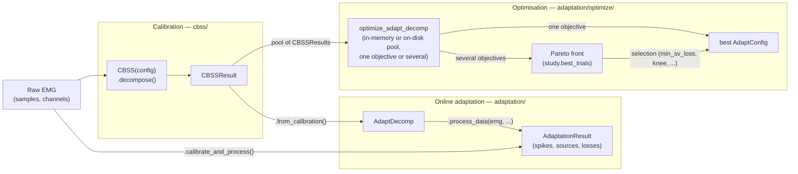

# Adaptive EMG decomposition in dynamic conditions based on online learning metrics with tunable hyperparameters

[](https://github.com/imendezguerra/adapt_decomp/actions/workflows/ci.yml)
[](https://doi.org/10.5281/zenodo.22902494)

This repository contains functions to adaptively decompose electromyography (EMG) into motor unit firings during dynamic conditions in real-time (~22 ms per 100 ms batch, CPU only with loss calculation) based on online learning metrics with tunable hyperparameters as described in [Mendez Guerra et al, JNE, 2024](https://dx.doi.org/10.1088/1741-2552/ad5ebf). The code is implemented in Python using PyTorch.

The full pipeline is as follows including calibration, hyperparameter optimisation, and adaptation:


```mermaid
%%{init: {'themeVariables': {'fontSize': '18px'}}}%%
flowchart LR
    EMG["Raw EMG\n(samples, channels)"]

    subgraph CAL["Calibration — cbss/"]
        CBSSC["CBSS(config)\n.decompose()"]
        RES["CBSSResult"]
        CBSSC --> RES
    end

    subgraph ADAPT["Online adaptation — adaptation/"]
        AD["AdaptDecomp"]
        OUT["AdaptationResult\n(spikes, sources, losses)"]
        AD -->|".process_data(emg, ...)"| OUT
    end

    subgraph OPT["Optimisation — adaptation/optimize/"]
        O["optimize_adapt_decomp\n(in-memory or on-disk pool,\none objective or several)"]
        FRONT["Pareto front\n(study.best_trials)"]
        BEST["best AdaptConfig"]
        O -->|"one objective"| BEST
        O -->|"several objectives"| FRONT
        FRONT -->|"selection (min_sv_loss, knee, ...)"| BEST
    end

    EMG --> CBSSC
    EMG -->|".calibrate_and_process()"| OUT
    RES -->|".from_calibration()"| AD
    RES -->|"pool of CBSSResults"| O
```

## Table of Contents
- [Installation](#installation)
- [Documentation](#documentation)
- [Tutorial](#tutorial)
- [FDSI benchmark](#fdsi-benchmark)
- [Development](#development)
- [Contributing](#contributing)
- [License](#license)
- [Citation](#citation)
- [Contact](#contact)

## Installation
To set up the project locally do the following:

1. Clone the repository:
    ```sh
    git clone https://github.com/imendezguerra/adapt_decomp.git
    ```
2. Navigate to the project directory:
    ```sh
    cd adapt_decomp
    ```
3. Create and activate the conda environment from `environment.yaml` (every dependency pinned to an exact version; also installs the package in editable mode):
    ```sh
    conda env create -f environment.yaml
    conda activate adapt_decomp
    ```
    Alternatively, with pip only (dependency versions are not pinned):
    ```sh
    pip install -e ".[dev]"
    ```

Please note that `environment.yaml` only installs the `cpu` version of `pytorch`. To enable GPU acceleration, `cuda` will need to be installed manually (check command [here](https://pytorch.org/get-started/locally/)).

The code is tested on macOS, Windows, and Linux in CI (see [Development](#development)).

## Documentation

The documentation site, **<https://imendezguerra.github.io/adapt_decomp/>**, has:

- **Getting started:** installation, the data, and the whole pipeline on one recording;
- **the user guide:** [architecture](docs/architecture.md), [calibration](docs/calibration.md),
  [adaptation](docs/adaptation.md) and [optimisation](docs/optimisation.md), also readable here;
- **how-to guides**, with tested code: calibrating, adapting, tuning, evaluating, plotting,
  running on a cluster, recording provenance and processing online;
- **the API reference**, generated from the docstrings;
- **the FDSI benchmark:** its design, a tour of the dataset and the results.

To build it locally: `pip install -e ".[docs]"` (or use `environment.yaml`), then `make docs`
(live preview) or `make docs-build` (`mkdocs build --strict`, as in CI).

## Tutorial

To learn how to use the adaptive decomposition, follow
[adaptive_emg_decomp_dyn_example](notebooks/original_tutorial/adaptive_emg_decomp_dyn_example.ipynb),
a step-by-step tutorial. It loads synthetic data and a precomputed decomposition model and runs
the adaptation pipeline on a simulated wrist dynamic contraction
([NeuroMotion](https://github.com/shihan-ma/NeuroMotion): a 15% MVC index flexion recorded
while the wrist ramps from 0° to -40° in a staircase pattern, precalibrated on the first 30 s
plateau).

## FDSI benchmark

[`benchmarks/fdsi/`](benchmarks/fdsi) runs `adapt_decomp` on 100 synthetic HD-EMG recordings
(100 channels) simulated with NeuroMotion via [MUniverse](https://github.com/dfarinagroup/muniverse)
(5 subjects × 5 wrist-kinematic conditions × 4 SNR levels, each with its ground-truth spike
trains): calibration, hyperparameter searches and their application to every recording, as one
cached, reproducible pipeline that runs locally or as PBS Pro array jobs. See its
[documentation](https://imendezguerra.github.io/adapt_decomp/benchmarks/fdsi/) and
[results](https://imendezguerra.github.io/adapt_decomp/benchmarks/fdsi/report/). The v1.0
benchmark notebooks are in [`notebooks/fdsi_benchmark/`](notebooks/fdsi_benchmark).

## Downloading the data

The notebooks read data that is too large to keep in the repository. It is published as three
independent archives, so you only fetch what you need:

| Archive | Size | What it is | DOI |
|---|---|---|---|
| `neuromotion-data` | 1.64 GB | The tutorial's simulated recording and its calibration. **Required by the tutorial.** | [10.5281/zenodo.22880910](https://doi.org/10.5281/zenodo.22880910) |
| `fdsi_benchmark-data` | 10.35 GB | The 100-recording benchmark itself. **Required by the benchmark notebooks.** | [10.5281/zenodo.22882346](https://doi.org/10.5281/zenodo.22882346) |
| `fdsi_benchmark-outputs` | 10.75 GB | Every cached pipeline stage. Optional, but recomputing the full grid takes hours. | [10.5281/zenodo.22882323](https://doi.org/10.5281/zenodo.22882323) |

A `data` archive is the dataset; the matching `outputs` archive is what this repository
produced from it. The benchmark notebooks are load-only by default, so
`fdsi_benchmark-outputs` is what lets you reproduce every figure in seconds instead of hours.
The tutorial has no outputs archive — it regenerates its own in minutes.

From the repository root, with the `adapt_decomp` environment active:

```sh
python scripts/download_data.py list                      # archives, sizes and DOIs
python scripts/download_data.py get neuromotion-data      # just the tutorial's input
python scripts/download_data.py get fdsi_benchmark        # both benchmark archives (prefix match)
python scripts/download_data.py get                       # everything (22 GB)
```

Files land in `data/<dataset>/{data,outputs}/`, which is exactly where the configs and
notebooks expect them — no manual placement needed. Each download is checked against the
checksum Zenodo publishes, and anything already unpacked is skipped, so re-running the command
is cheap.

Prefer to do it by hand? Download the zips from the DOIs list and unpack them all into `data/`. Each archive
carries its own full path, so any subset lands correctly:

```sh
unzip '*.zip' -d data/
```

Each dataset folder then contains its own `README.md` describing how the data was generated
and what every field means.

## Development

Install the git hooks once (`pre-commit` comes with the `dev` extras / `environment.yaml`).
They lint and format on every commit, check the dependency specs are in sync, and run the
fast tests on every push:

```sh
pre-commit install
pre-commit run --all-files   # optional: run every hook on the whole repo now
```

Common tasks are in the `Makefile` (`make test`, `make test-all`, `make lint`, ...).

**Dependencies** are declared in three places that must agree (enforced by
`ci/check_deps_sync.py` in pre-commit and CI):

| File | Holds | Tested by |
|------|-------|-----------|
| `pyproject.toml` | lower bounds (what `pip install` resolves) | CI on Python 3.10–3.12, Linux/macOS/Windows; weekly against new releases |
| `environment.yaml` | exact pins of every direct dependency (the reproducible environment) | CI on Linux/macOS/Windows |
| `ci/constraints-min.txt` | the lower bounds, pinned | CI `minimum-deps` job |

To change a dependency, update all three together.

**Reproducibility.** `tests/reproducibility/` re-runs the tutorial's adaptation (section 2.2,
NeuroMotion data, CPU) and compares spike trains, rate of agreement with the ground truth,
losses and final parameters against a stored reference. CI runs it on Linux, macOS and Windows
from `environment.yaml`. Locally:

```sh
make data    # download the NeuroMotion tutorial data (~1.6 GB), once
make repro   # pytest tests/reproducibility -m repro
```

Only regenerate the reference (`make reference`) when results are *meant* to change, and say so
in `CHANGELOG.md`.

## Contributing
We welcome contributions! Here's how you can contribute:

1. Fork the repository.
2. Create a feature branch (`git checkout -b feature/newfeature`).
3. Commit your changes (`git commit -m 'Add some newfeature'`).
4. Push to the branch (`git push origin feature/newfeature`).
5. Open a pull request.

## License
This repository is licensed under the MIT License.

## Citation

If you use this code in your research, please cite this repository:

```
@article{Mendez Guerra_2024,
   author={Mendez Guerra, Irene and Barsakcioglu, Deren Y. and Farina, Dario},
   title={Adaptive EMG decomposition in dynamic conditions based on online learning metrics with tunable hyperparameters},
   journal={Journal of Neural Engineering},
   publisher={IOP Publishing},
   volume={21},
   number={4},
   ISSN={1741-2552},
   DOI={10.1088/1741-2552/ad5ebf},
   url={https://dx.doi.org/10.1088/1741-2552/ad5ebf}
   }
```

## Contact

For any questions or inquiries, please contact us at:
```
Irene Mendez Guerra
irene.mendez17@imperial.ac.uk
```
