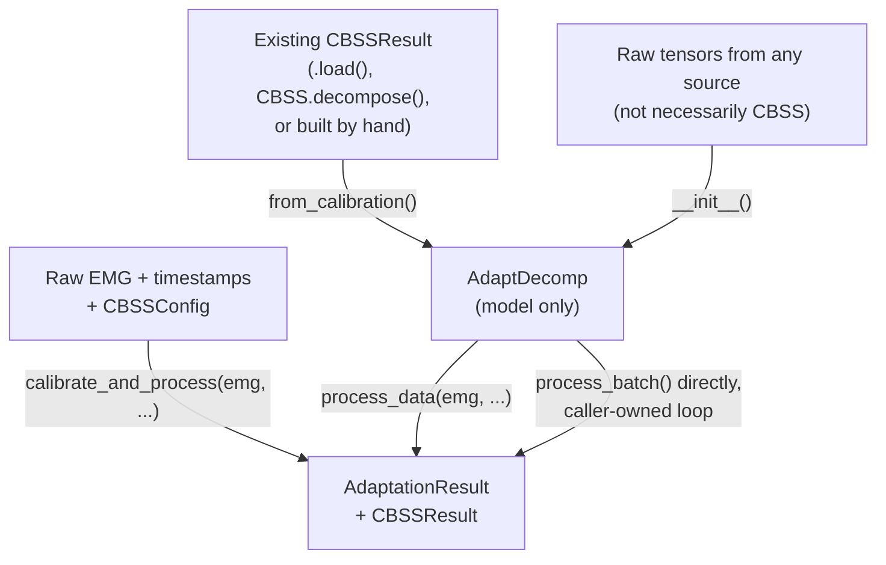

# Adaptation (`adaptation/`)

`AdaptDecomp` runs a precalibrated decomposition forward over a full
recording, batch by batch: whiten → estimate sources → detect spikes →
(optionally) adapt whitening, separation vectors, and spike/base centroids.
It never runs ICA itself — it only ever tracks a calibration it was given.

## Building the model, then supplying data

Construction (`__init__`/`from_calibration`) never touches `emg` — it only
ever builds the calibrated model. `process_data(emg, ...)` is the one place
`emg` ever enters an `AdaptDecomp`, except a deprecated v1-compatible path
(see the note at the end of this section).



Three run modes, chosen via `process_data`'s/`init_data`'s
`processing_mode`:

| Mode | `processing_mode` | Driven by |
|---|---|---|
| Offline — whole recording preprocessed upfront | `"offline"` (default) | `process_data()`'s own loop |
| Online simulation — raw batches, `process_batch` preprocesses each | `"online"` | `process_data()`'s own loop, over raw batches |
| Full online — no predetermined recording | n/a — `process_data()`/`init_data()` are never called | a caller-owned loop calling `process_batch()` directly |

### 1. Calibration + adaptation in one call

`calibrate_and_process` runs `CBSS` on `emg[calib_indices]`, builds the
model, and — since it already has the full `emg` in hand — also runs
`process_data()` over it, returning both results directly rather than the
`AdaptDecomp` instance itself:

```python
from adapt_decomp import AdaptDecomp
from adapt_decomp.cbss.config import CBSSConfig
from adapt_decomp.adaptation.config import AdaptConfig

outputs, calibration = AdaptDecomp.calibrate_and_process(
    emg=emg,                                        # (samples, channels) — full recording
    timestamps=timestamps,                          # (samples,) seconds
    calib_indices=slice(0, 10240),                  # or an index/boolean array
    cbss_config=CBSSConfig(fs=2048, ext_fact=10),   # selection/selection_kwargs filter units here
    adapt_config=AdaptConfig(),                     # for shared params, adapt_config is overwritten with cbss_config vals if mismatch
    processing_mode="offline",                      # or "online"
)
```

Use this when calibration and adaptation share one script, you want both
results directly, and don't need the `AdaptDecomp` instance itself
afterward (e.g. for `adapter.spikes` direct access, or to run it again
over different data — use `from_calibration` + `process_data` separately
for those).

### 2. From a previous CBSS calibration

For a calibration already computed elsewhere — loaded from disk, produced by
a separate calibration script, or filtered/reselected after the fact —
`from_calibration` only builds the model; call `process_data(emg, ...)`
yourself once the recording is available:

```python
from adapt_decomp import AdaptDecomp, CBSSResult
from adapt_decomp.cbss.config import CBSSConfig

calibration = CBSSResult.load("calibration/sub-01_cbss.pkl")           # calibration.emg must be set
cbss_config = CBSSConfig.from_yaml("calibration/sub-01_cbss_config.yaml")  # the sibling config
adapter = AdaptDecomp.from_calibration(
    calibration=calibration,
    cbss_config=cbss_config,       # required — see "Config essentials" below
    adapt_config=AdaptConfig(),    # omit to auto-build an AdaptConfig from cbss_config's shared fields
)
outputs = adapter.process_data(full_recording_emg)   # (samples, channels)
```

`from_calibration` is the CBSS-specific factory: it's hard-typed to
`CBSSResult` and unpacks it via `calibration.to_adapt_tensors()`.
`calibration.gt_matched_indices` (if the calibration went through
`select_supervised`) is carried onto the instance and threaded through
`outputs.gt_matched_indices`.

### 3. From a different (non-CBSS) object

For a calibration that didn't come from `cbss/` at all — any pipeline that
can produce the same raw tensors:

```python
adapter = AdaptDecomp(
    whitening=whitening,        # (n, n)
    sep_vectors=sep_vectors,    # (n, M)
    base_centr=base_centr,      # (M,)
    spikes_centr=spikes_centr,  # (M,)
    emg_calib=emg_calib,        # (N_cal, channels) — raw, unextended
    sources_calib=sources_calib,  # (N_cal, M)
    spikes_calib=spikes_calib,  # (N_cal, M) binary
    adapt_config=AdaptConfig(),
)
outputs = adapter.process_data(emg, preprocess=True)   # emg: (samples, channels)
```

`process_data(emg, preprocess, processing_mode)` always calls
`init_data(emg, preprocess, processing_mode)` first — the same thing as
calling it separately, just collapsed into one call. Call `init_data()`
yourself first only when you want to inspect `adapter.data` (or time
preprocessing separately) before running.

### Online simulation and full online mode

Passing `processing_mode="online"` to `process_data()`/`init_data()`
switches `process_batch` from consuming pre-extended rows to preprocessing
each raw batch itself — filtering, channel-selecting, centring, and
extending it — carrying filter/mean/extension state across calls on
`Decomposition` (`zi`, `ema_mean_online`, `ext_fifo`):

```python
outputs = adapter.process_data(emg, processing_mode="online")
```

This still needs the whole recording in hand (fed to `process_data()`
batch by batch internally, over raw rows) — useful for validating the
true per-batch pipeline against a known recording before deploying it.
For genuinely unbounded online use, where there is no predetermined
recording, skip `process_data()`/`init_data()` entirely and call
`process_batch()` directly, in a loop you own, as each chunk arrives:

```python
for chunk in live_feed:
    spikes, sources = adapter.process_batch(chunk)
```

Neither mode's output values are expected to be bit-identical to the
offline mode's, since streaming preprocessing centres each batch with a
running EMA mean rather than the whole recording's own mean.

### Deprecated: v1-compatible `emg=...` + `.run()`

For code migrating from v1's `AdaptDecomp(emg=..., ...).run()` pattern,
passing `emg` to `__init__` still works — it's stored, not consumed, until
`.run()` reads it and calls `process_data(emg, processing_mode="offline")`:

```python
adapter = AdaptDecomp(..., emg=emg)   # raises FutureWarning
outputs = adapter.run()               # raises FutureWarning; equivalent to
                                       # adapter.process_data(emg, processing_mode="offline")
```

Both calls raise `FutureWarning`; `.run()` raises `ValueError` if called on
an instance built without `emg`. Use `process_data(emg, ...)` directly
instead — this path exists only for backward compatibility and will be
removed in a future version.

## Config essentials

The full field-by-field reference is in the main README's
[AdaptConfig reference](../README.md#adaptconfig-reference). The fields
you'll touch most often:

| Field | Purpose |
|-------|---------|
| `adapt_wh` / `adapt_sv` / `adapt_sd` | Turn whitening / separation-vector / centroid adaptation on or off independently |
| `batch_ms` | Batch duration (ms); drives `batch_size = batch_ms * fs / 1000` |
| `wh_learning_rate` / `sv_learning_rate` | Step-size hyperparameters — see the main README's [Optimization](../README.md#optimization) section to tune them |
| `wh_mode` / `lr_mode` / `contrast_scope` | Mode switches for the whitening/separation-vector update — see [Mode choices](#mode-choices-wh_mode-lr_mode-contrast_scope) below |
| `compute_loss` | Populate `wh_loss`/`sv_loss`/`wh_trace`/`wh_loss_total`/`sv_loss_total`/`total_loss` on the output |
| `debug` | Store full per-batch diagnostics in `outputs.diagnostics` |

### Mode choices: `wh_mode`, `lr_mode`, `contrast_scope`

Three fields switch between alternative formulas for the whitening and
separation-vector updates. **Stick with the defaults unless you have a
specific reason not to** — they're what this package is tuned and tested
against; the alternatives exist for ablations and need their own separate
hyperparameter tuning if you switch to them.

| Field | Default (recommended) | Alternative |
|-------|------------------------|--------------|
| `wh_mode` | `"kl_to_identity"` — whitening error is the KL divergence between the current batch's whitened covariance and the identity matrix (how far this batch is from being perfectly whitened) | `"kl_to_cal"` — KL divergence against the *calibration* whitened covariance instead, tracking drift relative to the calibration reference frame rather than pure whitening quality |
| `lr_mode` | `"fixed"` — a plain fixed-rate step (`wh -= wh_learning_rate * grad`, `sv += sv_learning_rate * grad`), reproducing v1's behaviour exactly; the step size doesn't shrink as the model reconverges to calibration | `"rel_error"` — unit-normalises the natural-gradient direction and scales the step by the z-scored error, giving error-driven negative feedback (the step shrinks toward zero as error goes to zero) |
| `contrast_scope` | `"spike_based"` — the separation-vector contrast is computed only at detected, trusted spike times; a unit with too few spikes in a batch contributes no gradient that batch | `"batch_based"` — computed over every sample in the current batch instead |

### Shared parameters with calibration
`ext_fact`, `ext_mode`, `spike_det_exp`, the preprocessing/filter fields
(`fs`, `lowcut`, `highcut`, `filter_order`, `powerline`, `powerline_freq`,
`notch_*`), and `ch_mask`/`ch_map`/`replace_bad_channels` must match calibration, because `AdaptDecomp` reuses this
calibration's frozen state (`emg_calib`, `sources_calib`, `Rz_cal`,
`Q75_cal`/`IQR_cal`, ...) as the reference online adaptation drifts against.
`from_calibration` enforces this for you: it takes the calibration's own
`CBSSConfig` (`cbss_config`, required) as ground truth and reconciles
`adapt_config` against it, overwriting any disagreement and raising a single
`UserWarning` naming what changed, except `ext_fact` itself — a mismatch
there between `cbss_config` and `calibration.ext_fact` raises a `ValueError`
immediately, since it signals the wrong calibration was passed in. Building
`AdaptDecomp` directly (path 3 above, no `cbss_config` involved) has no such
check — `Decomposition.__init__` only catches an `ext_fact` mismatch that
actually produces a dimension error.

`contrast_fun` is a deliberate exception: it only picks which contrast
function CBSS's own ICA search uses to *find* units. `AdaptDecomp` always
derives its own contrast reference (`contrast_calib_mean`/`_std`) straight
from `sources_calib` via `log_cosh`, regardless of what found them.

## Reproducibility

`AdaptDecomp` has no randomness of its own — there's no `random_seed` field
on `AdaptConfig`, and every update in `ops.py` is a deterministic tensor
transform of the current state. Given the same calibration (a `CBSSResult`
built with a fixed `random_seed`, see
[calibration.md#reproducibility](calibration.md#reproducibility)), the same
`emg`, and the same `AdaptConfig`, a run is otherwise fully reproducible on
CPU.

Two things beyond the config still change the result if you change them
between runs:

- **Batch boundaries.** The `wh`/`sv`/centroid updates are sequential and
  history-dependent — each batch's update starts from the running state the
  previous batch left behind — so `batch_ms`/`batch_size` isn't just a speed
  knob: a different batch size changes the actual sequence of updates, not
  only how many of them run. Reproducing a run means reusing its `batch_ms`
  too, not just its learning rates.
- **`processing_mode="online"` state.** The streaming path carries filter
  state (`zi`), a running centring mean (`ema_mean_online`), and the
  extension FIFO (`ext_fifo`) across `process_batch()` calls on
  `Decomposition`. Reproducing an online-mode run means feeding it the same
  batches in the same order — a caller-owned loop calling `process_batch()`
  directly (see
  [Online simulation and full online mode](#online-simulation-and-full-online-mode)
  above) is only reproducible if the caller reproduces its own chunking too.
  This is also why `"online"` and `"offline"` aren't expected to agree with
  each other bit-for-bit: the offline path centres against the whole
  recording's own mean, not a running EMA.

On `device="cuda"`, as with calibration, exact bit-for-bit reproducibility
across runs isn't guaranteed on top of a fixed config — PyTorch's CUDA
kernels for matmul/reduction ops aren't bitwise-deterministic by default,
and this repo doesn't turn on `torch.use_deterministic_algorithms(True)`.
Over a long run these per-batch differences can compound, since each
batch's update starts from the previous batch's state. Prefer `device="cpu"`
if you need a run to reproduce exactly.

## Running and reading the output

`process_data()`/`calibrate_and_process()` return an `AdaptationResult` —
`M` below is the unit count from calibration, `samples` the recording
length, `batches` the number of batches processed:

```python
outputs = adapter.process_data(emg)   # AdaptationResult

outputs.spikes        # (samples, M) int32 binary spike train
outputs.sources        # (samples, M) float32 source signal (pre-sv-update)
outputs.wh_loss         # (batches,) — only if compute_loss=True
outputs.preprocess_time_ms  # (batches,) per-batch preprocessing time; zero unless processing_mode="online"
outputs.total_time_ms   # (batches,) per-batch wall time

outputs["spikes"]       # dict-style access also works
```

Save/load an `AdaptationResult` with `save()`/`load()`:

```python
outputs.save("run_result.pkl")

from adapt_decomp import AdaptationResult
outputs = AdaptationResult.load("run_result.pkl")
```

### Field reference

Always set (every `process_data()`/`process_batch()` call populates these):

| Field | Type | Shape | Meaning |
|-------|------|-------|---------|
| `spikes` | `torch.Tensor` (int32) | `(samples, M)` | Binary spike train, one column per unit |
| `sources` | `torch.Tensor` (float32) | `(samples, M)` | Source signal *before* that batch's sv update, so a given sample's value is consistent regardless of which later batch you inspect it from |
| `preprocess_time_ms` | `torch.Tensor` | `(batches,)` | Per-batch preprocessing wall time (ms). Zero when the data was already preprocessed upfront (`processing_mode="offline"`); non-zero only under `processing_mode="online"`, where each raw batch is filtered/centred/extended on the fly |
| `wh_time_ms` | `torch.Tensor` | `(batches,)` | Per-batch whitening-step wall time (ms) |
| `sv_time_ms` | `torch.Tensor` | `(batches,)` | Per-batch separation-vector-step wall time (ms) |
| `sd_time_ms` | `torch.Tensor` | `(batches,)` | Per-batch spike-detection-step wall time (ms) |
| `total_time_ms` | `torch.Tensor` | `(batches,)` | Per-batch total wall time (ms), summing the steps above plus any preprocessing |

Set only when `AdaptConfig.compute_loss=True` (`None` otherwise):

| Field | Type | Shape | Meaning |
|-------|------|-------|---------|
| `wh_loss` | `Optional[torch.Tensor]` | `(batches,)` | Whitening loss for that batch (formula depends on `wh_mode`) |
| `sv_loss` | `Optional[torch.Tensor]` | `(batches, M)` | Separation-vector contrast loss, per batch and per unit |
| `wh_trace` | `Optional[torch.Tensor]` | `(batches,)` | Trace of that batch's whitened covariance |
| `wh_loss_total` | `Optional[torch.Tensor]` | scalar | Guarded `median(wh_loss)` over the whole run — see `AdaptDecomp._compute_losses()` |
| `sv_loss_total` | `Optional[torch.Tensor]` | scalar | Guarded `median(sv_loss.nansum(dim=1))` — per-batch sum across units, then medianed across batches |
| `total_loss` | `Optional[torch.Tensor]` | scalar | `wh_loss_total + sv_loss_total`, the single score used for Optuna/wandb search |

Set only under other specific conditions:

| Field | Type | Shape | Meaning |
|-------|------|-------|---------|
| `diagnostics` | `Optional[Dict[Any, Any]]` | keyed by batch index | Full per-batch diagnostic tensors; populated only when `AdaptConfig.debug=True` |
| `gt_matched_indices` | `Optional[np.ndarray]` | `(M,)` | Index into a ground-truth unit set, one entry per unit; only set when the instance was built via `from_calibration()` from a calibration that went through `select_supervised` |
| `roa` | `Optional[np.ndarray]` | `(M,)` | Rate of agreement against a ground-truth spike train, per unit. Mirrors `CBSSResult.roa`'s convention but is never computed here — a caller sets it after running its own comparison (e.g. `spikes.comparison.rate_of_agreement_paired`), as `optimize.py`'s `optimize_adapt_decomp_pooled_memory(compute_roa=True)` does |

`to_dict()` (and therefore `outputs["key"]`/`outputs.get("key")`/`key in
outputs`) only ever includes fields that aren't `None` — so a run without
`compute_loss`/`debug` won't show `wh_loss`/`diagnostics` etc. in dict form,
even though the attribute still exists (as `None`) on the object itself.

## Saving per-batch parameters

To persist the whitening/separation/centroid matrices at every batch (not
just the final state), set `save_params=True` on the config and pass
`save_path` to any of the three constructors:

```python
adapter = AdaptDecomp.from_calibration(
    calibration=calibration, cbss_config=cbss_config,
    adapt_config=AdaptConfig(save_params=True),
    save_path="run_params.h5",
)
outputs = adapter.process_data(emg)
```

This is a per-batch HDF5 trace (`adaptation/io.py`), distinct from
`optimize.py`'s `best_result_path`, which snapshots only the winning trial's
final `AdaptationResult` — see the main README's
[Optimization](../README.md#optimization) section.

## Next

To search `wh_learning_rate`/`sv_learning_rate` (or other fields) instead of
setting them by hand, see the main README's
[Optimization](../README.md#optimization) section.
