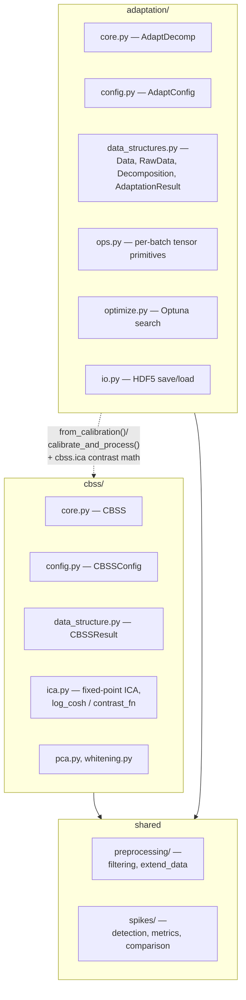
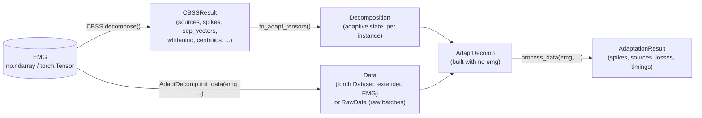

# Architecture

`adapt_decomp` splits into two independent subsystems sharing common
utilities. This page covers the repo layout, *why* it's split this way, and
*how objects move between the pieces*.

## Why two subsystems

- **`cbss/`** — one-off **calibration**: convolutive blind source separation
  run once on a calibration window to find motor units. 
- **`adaptation/`** — per-batch **online adaptation**: takes a calibration and
  tracks it forward over a full recording, batch by batch.

They're split because they have different lifecycles and different
performance constraints (`cbss` runs once, offline; `adaptation` runs every
~100ms batch, needs to be fast). `cbss` has **no dependency on**
`adaptation` — it never imports it — so calibration stays usable
standalone, in notebooks, or from other tooling, without pulling in the
online-adaptation stack.

**Provenance.** `cbss/`'s algorithm is inspired by the
CBSS implementation in
[muniverse](https://github.com/dfarinagroup/muniverse/tree/main/src/muniverse/algorithms)
but using in Pytorch for faster execution.

## Subpackage dependency graph

The dashed arrow is the **only** coupling in that direction:
`adaptation.core.AdaptDecomp.from_calibration`/`calibrate_and_process`
consume `CBSSResult`/`CBSSConfig`/`CBSS` directly, and
`adaptation/data_structures.py`/`adaptation/ops.py` import `log_cosh`/
`contrast_fn` from `cbss.ica` rather than duplicating the contrast math.
Nothing in `cbss/` imports anything from `adaptation/`.

## Object handoff across the pipeline

Construction never touches `emg`; `process_data(emg, ...)` is the one
place it ever enters (besides a deprecated v1-compatible path — see
[adaptation.md](adaptation.md)), always calling `init_data(emg, preprocess,
processing_mode)` first — on an instance built via `from_calibration` or
directly. `calibrate_and_process` runs both steps itself, returning
`(AdaptationResult, CBSSResult)` directly rather than the instance.
`init_data()` builds `Data` (`processing_mode="offline"`, the default:
preprocessed upfront) or `RawData` (`"online"`: `process_batch`
preprocesses each raw batch itself, carrying filter/mean/extension state
across calls on `Decomposition` — `zi`, `ema_mean_online`, `ext_fifo`,
alongside its existing `fifo_cov`/`source_fifo` adaptive state). A caller
can also skip `process_data()`/`init_data()` entirely and call
`process_batch()` directly, batch by batch, for genuinely unbounded
online use.

`CBSSResult` and `AdaptationResult` are deliberate structural siblings (both
dataclasses with `save()`/`load()`, `to_dict()`, and dict-style
`__getitem__`/`get()`) but are **not** the same class — calibration and
online-adaptation outputs have different shapes and don't need to
interoperate beyond `CBSSResult.to_adapt_tensors()` feeding `AdaptDecomp`.

## `utils/`

Small, domain-agnostic helpers with no natural home in either subsystem live
in their own `utils/` subpackage instead of inside `cbss/` or `adaptation/`:

- **`utils.py`** — `validate_literals`, `dtype_from_string`, `to_yaml_safe`;
  `validate_literals` is shared by `CBSSConfig` and `AdaptConfig`.
  Deliberately kept minimal.
- **`loaders.py`** — `load_data`, dispatching to `load_example` (a single
  legacy-format recording) or `load_pooled_cbss_memory`/
  `load_pooled_cbss_disk` (one or more `CBSSResult`s, returning
  `Dict[str, PooledDatasetMemory]`/`Dict[str, PooledDatasetDisk]`) — see
  [calibration.md](calibration.md#path-b--loading-from-a-different-object)
  and [optimisation.md](optimisation.md).
- **`plots.py`** — comparison/diagnostic plots.

`utils/__init__.py` re-exports all of the above, so callers use
`from adapt_decomp.utils import load_data, validate_literals, ...` (or the
top-level `from adapt_decomp import load_data, ...`) rather than reaching
into the individual files.

## Config objects

Both subsystems follow the same dataclass pattern: `CBSSConfig` and
`AdaptConfig` are plain dataclasses with `__post_init__` for derived fields
(e.g. `spike_min_dist` from `spike_min_dist_ms`/`fs`), and both load/save via
`from_yaml`/`to_yaml`. Neither is ever used as a mutable default argument —
every constructor that takes one defaults to `None` and builds a fresh
instance inside the function body. See the main README's
[AdaptConfig reference](../README.md#adaptconfig-reference) for the full
field table.
