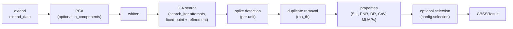

# Calibration (`cbss/`)

CBSS (Convolutive Blind Source Separation) turns a window of raw HD-EMG into
a set of motor units: separation vectors, a whitening matrix, spike trains,
and quality metrics. It runs once, offline, over a calibration window; the
result — a `CBSSResult` — is what [adaptation.md](adaptation.md) and
[optimisation.md](optimisation.md) build on.

**Provenance.** This module is inspired by the
CBSS implementation in
[muniverse](https://github.com/dfarinagroup/muniverse/tree/main/src/muniverse/algorithms)
but using in Pytorch for faster execution.

## Path A — direct calibration from raw EMG

```python
from adapt_decomp import CBSS, CBSSConfig

config = CBSSConfig(
    # Preprocessing
    fs=2048.0,                   # sampling frequency, in Hz
    preprocess_emg=True,         # filter + notch the EMG before extension/whitening
    lowcut=20.0,                 # high-pass cutoff, in Hz
    highcut=500.0,               # low-pass cutoff, in Hz
    filter_order=4,              # Butterworth filter order
    powerline=True,              # apply powerline notch filtering
    powerline_freq=50.0,         # powerline frequency to notch out, in Hz (50 or 60)
    notch_width_hz=1.0,          # half-bandwidth per notch, in Hz
    notch_n_harmonics=3,         # number of powerline harmonics notched out
    notch_order=2,               # notch filter order
    replace_bad_channels=False,  # interpolate ch_mask's False channels with neighbours via ch_map
    ch_mask=None,                # boolean, length = raw channel count; True = keep, False = drop
    ch_map=None,                 # electrode grid layout, required if replace_bad_channels

    # Extension
    ext_fact=10,                 # number of delayed copies per channel
    ext_mode="block",            # or "toeplitz"

    # PCA
    n_components=None,           # or an int, to reduce dimensionality before whitening

    # Whitening
    whitening_method="ZCA",      # or "PCA"
    regularization="auto",       # or a float, or None
    eps=1e-10,                   # numerical stability constant added during whitening

    # ICA
    contrast_fun="square",       # or "logcosh", "cube", or "smooth_abs"
    contrast_exp=3.0,            # only used for "smooth_abs"
    search_iter=100,             # random re-initialisations attempted
    ica_iter=100,                # max fixed-point iterations per attemp (early-stopped on convergence)
    ica_tol=1e-4,                # convergence tolerance on ||w_new . w_prev| - 1|

    # Spike detection
    spike_det_exp=2.0,           # power the source amplitude is raised to before peak detection.
    spike_min_dist_ms=10.0,      # minimum inter-spike distance, in ms

    # Refinement loop
    refinement_loop=True,        # run the iterative refinement loop after initial ICA convergence
    refinement_mode="sil",       # or "cov_isi" -- metric used to pick the best refinement iteration
    refine_max_iter=20,          # maximum number of refinement iterations

    # Quality control
    sil_th=0.9,                  # minimum silhouette score for a unit to pass quality gating
    min_spikes=10,               # minimum spike count for a unit to pass quality gating

    # Duplicate removal
    roa_th=0.3,                  # rate-of-agreement threshold above which two units are duplicates
    run_duplicate_removal=True,  # remove duplicate units after ICA search

    # Unit selection (post-hoc filter, applied inside decompose())
    selection=None,              # or "unsupervised" / "supervised"
    selection_kwargs=None,       # forwarded to CBSSResult.select_unsupervised()/select_supervised()

    # Compute properties
    compute_properties=True,     # gates pnr/dr/muaps. Required for unsupervised selection

    # Result storage
    save_emg=True,               # required if this result will feed AdaptDecomp later

    # Compute device
    device="cpu",                # or "cuda"/"mps"; None = auto-select CUDA > MPS > CPU
    dtype="float32",             # floating point precision used for computation

    # Reproducibility
    random_seed=1909,            # fixed by default

    # Logging
    verbose=False,               # print progress during decomposition
)
result = CBSS(config).decompose(emg, timestamps)  # emg: (samples, channels)
```
The snippet shows every field of [CBSSConfig](..\src\adapt_decomp\cbss\config.py)

`ch_mask` is `None` by default (no channel selection at all). Set it to a
boolean mask (`True` = keep) to either drop (`replace_bad_channels=False`)
or interpolate (`replace_bad_channels=True`, needs `ch_map`) the `False`
channels. Both modes are supported together with `ch_map`. `ch_mask`/`ch_map`/`replace_bad_channels` are
also reconciled onto `AdaptConfig` the same way as `ext_mode`/
`spike_det_exp`/the filter fields — see
[adaptation.md](adaptation.md#config-essentials).

`n_components` is optional: `None` (the default) skips PCA entirely and
passes the extended EMG straight to whitening, while an int fits a PCA
model to reduce it to that many components first (mainly useful to reduce quiet channels after extension). The fitted `pca_components`/`pca_mean` are stored on
`CBSSResult` and reused (never refit) by `AdaptDecomp` online, so
`n_components` is effectively frozen for the lifetime of a calibration.

`decompose()` runs the full pipeline in one call:



Each ICA search attempt either survives quality gating (`min_spikes`, `sil_th`) and becomes a unit, or is discarded. The units that survive quality gating are compared to previously detected units based on their rate of agreement (`roa`) and duplicates are removed if `roa` >= `roa_thr`. `search_iter` controls how many random initialisations are tried, while `ica_iter` determines how many ica iterations are tried per `search_iter` (early stopped if converged).

### Unit selection

`decompose()` returns every discovered unit after the previous gatings, but additional ones can be imposed using `CBSSConfig.selection` based on physiolocial properties (`selection="unsupervised"`) or ground truth (`selection="supervised"`):

```python
config = CBSSConfig(..., selection="unsupervised", selection_kwargs={"sil_th": 0.9, "pnr_th": 30})
# or: selection="supervised", selection_kwargs={"gt_spikes": gt, "roa_th": 0.9}
```

The same filters are always callable standalone on any `CBSSResult`, whether
or not `selection` was set at calibration time:

```python
result = result.select_unsupervised(sil_th=0.9, dr_min=5, dr_max=35)
# or, against ground truth:
result = result.select_supervised(gt_spikes, roa_th=0.9, fs=2048)
```

Both return a new `CBSSResult` (via `CBSSResult.subset()`) — the original is
untouched.

## Path B — loading from a different object

Three ways to get a ready `CBSSResult` without re-running `decompose()`:

**1. Reload a saved calibration.**

```python
from adapt_decomp import CBSSResult

result = CBSSResult.load("calibration/sub-01_cbss.pkl")   # written by result.save(path)
```

**2. Apply an existing calibration's parameters to new EMG**, reusing its
extension mean, PCA/whitening matrices, and separation vectors, re-running
only spike detection:

```python
cbss = CBSS(config)                    # same config used to produce `result`
applied = cbss.apply(new_emg, result, timestamps)
```

Use this to score a calibration against a *different* recording without
re-decomposing from scratch — `apply()` does not re-run ICA.

**3. Build a `CBSSResult` by hand from a foreign format.** Any pipeline that
produces the same fields can be wrapped into a `CBSSResult` and used
everywhere downstream expects one. `utils/loaders.py`'s
`_cbss_result_from_mat_decomp` is the reference example — it reconstructs a
`CBSSResult` from a legacy MATLAB `.mat` decomposition:

```python
CBSSResult(
    sources=ipts,            # [T, n_mu]
    spikes=spikes,           # [T, n_mu] int32
    spikes_dict=spikes_dict, # {unit_id: sample indices}
    sep_vectors=sep_vectors, # [dim, n_mu]
    whitening=whitening,     # [dim, dim]
    extension_mean=ext_mean, # [1, C*ext_fact]
    spikes_centr=spike_centr, base_centr=base_centr,  # [n_mu] each
    sil=sil, cov_isi=cov_isi,                          # [n_mu] each
    ext_fact=ext_fact,
    emg=emg_calib, timestamps=timestamps,   # required if used with AdaptDecomp
)
```

`pca_components`/`pca_mean` stay `None` unless the source pipeline used PCA
reduction; every other optional field (`pnr`, `dr`, `muaps`,
`gt_matched_indices`, `roa`) defaults to `None` and is safe to leave unset.

## Saving a calibration

```python
result.save("calibration/sub-01_cbss.pkl")   # pickle round-trip via CBSSResult.load()
```

`utils/loaders.py`'s `load_pooled_cbss_memory`/`load_pooled_cbss_disk` (see
[optimisation.md](optimisation.md)) expect exactly this format — a pickled
`CBSSResult` referenced by `path_calib` in a data config YAML.

## Reproducibility

`random_seed` (default `1909`) is CBSS's only reproducibility knob. Setting
it seeds a dedicated CPU generator (`self._rng`) used for the ICA search's
random re-initialisation order (`torch.randperm`, one draw per `search_iter`
attempt — see `_extraction_loop_full`), plus the global `random`/`numpy`/
`torch`/`torch.cuda` RNG state, in case anything else reads from it.
`random_seed=None` skips all of the above, so the initialisation order —
and therefore which units get discovered — differs on every run.

Given the same `random_seed`, `emg`, and `CBSSConfig`, `decompose()` is
otherwise deterministic on CPU. On `device="cuda"`, exact bit-for-bit
reproducibility across runs isn't guaranteed on top of a fixed seed —
PyTorch's CUDA kernels for matmul/reduction ops aren't bitwise-deterministic
by default, and this repo doesn't turn on
`torch.use_deterministic_algorithms(True)`. That can occasionally flip
which candidate survives ICA's collapse/quality gating right at the margin.
Prefer `device="cpu"` for a calibration you need to reproduce exactly.

`CBSSResult.save()`/`.load()` persist the *result*, not the config used to
produce it. Save `config` alongside it too
(`config.to_yaml("sub-01_cbss_config.yaml")`) if you need to reproduce the
run itself later, not just reload its output — `from_calibration` expects
exactly this sibling-config pattern, see
[adaptation.md](adaptation.md#2-from-a-previous-cbss-calibration).

## Next

Feed the result into `AdaptDecomp.from_calibration()` — see
[adaptation.md](adaptation.md).
