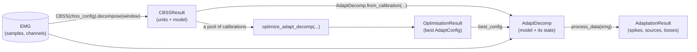

# Overview

adapt_decomp decomposes a recording in two stages:

1. **[Calibration](calibration.md)** runs once, offline, on a short window of the recording
   (typically a few seconds of steady contraction). Convolutive blind source separation (CBSS)
   finds the motor units, and the model that separates them: a whitening matrix, one
   separation vector per unit and the thresholds that detect its spikes.
2. **[Adaptation](adaptation.md)** runs that model over the rest of the recording in batches
   (100 ms by default), as it would in real time. In every batch it also updates the model, so
   the units are still tracked when the EMG changes with the contraction: joint angle, force,
   electrode shift.

How fast the model changes is set by a few hyperparameters, the learning rates and a momentum.
**[Hyperparameter optimisation](optimisation.md)** chooses them for a dataset.

## The objects

| Object | Made by | Holds |
|---|---|---|
| `CBSSConfig` | you | The calibration settings |
| `CBSSResult` | `CBSS.decompose()` | The units (sources, spikes, quality metrics) and the model |
| `AdaptConfig` | you, a preset (`AdaptConfig.from_preset`) or a search | The adaptation settings |
| `AdaptDecomp` | `AdaptDecomp.from_calibration()` | The model, and its state as it adapts |
| `AdaptationResult` | `process_data()`, `AdaptDecomp.calibrate_and_process()` | Spikes and sources over the recording, losses, timings |
| `OptimisationResult` | `optimize_adapt_decomp()` | The best `AdaptConfig` and the Optuna study |

Configs are saved and loaded with `to_yaml()`/`from_yaml()`, results with `save()`/`load()`.
Results also read like dicts: `result["spikes"]` is `result.spikes`.

## Building the adaptation

| Use | When |
|---|---|
| `AdaptDecomp.from_calibration(calibration, cbss_config, adapt_config)` | You have a `CBSSResult`, just computed or loaded. The usual path. |
| `AdaptDecomp.calibrate_and_process(emg, timestamps, calib_indices, cbss_config, adapt_config)` | One call that calibrates on a window, then adapts over the whole recording. Returns `(AdaptationResult, CBSSResult)`. |
| `AdaptDecomp(whitening=..., sep_vectors=..., ...)` | Your calibration comes from another tool. |

## Processing modes

| Mode | How | Use it to |
|---|---|---|
| Offline (default) | `process_data(emg)` preprocesses the whole recording first, then adapts batch by batch | analyse recordings |
| Online simulation | `process_data(emg, processing_mode="online")` filters, centres and extends each raw batch as it arrives | check the real-time path on a recording |
| Live | `process_batch(chunk)`, in a loop you own | process a live feed |

The online modes centre each batch with a running mean instead of the whole recording's, so
their output is close to, but not the same as, the offline mode's.
