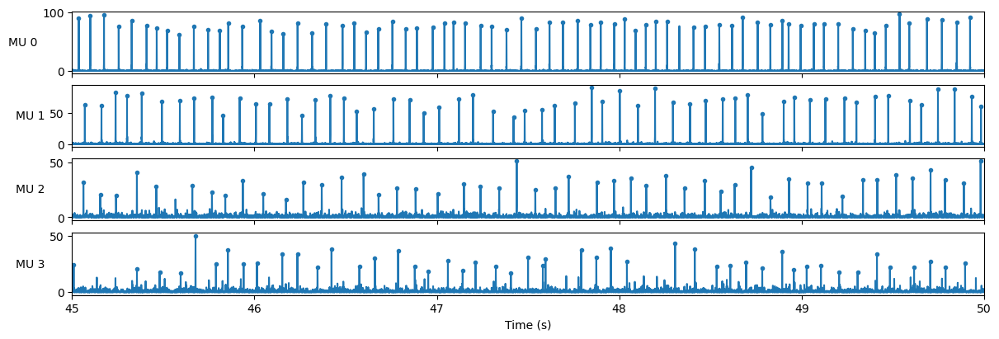
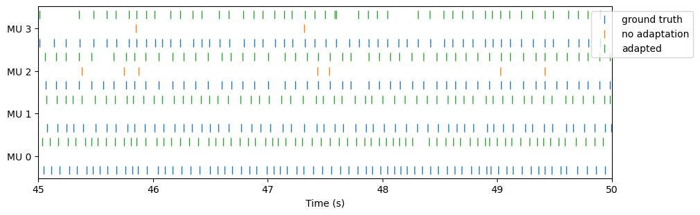

# Plot results

These examples continue the [quickstart](../getting-started/quickstart.md), with its `adapted`
and `fixed` results and the ground truth paired to the units (`gt_paired`).

## Sources

`plot_sources` draws each unit's source, one row per unit, with its detected spikes marked.
Several results passed together are overlaid, one colour each.

```python
--8<-- "workflow.py:plot-sources"
```



## Spikes

`plot_spikes` draws spike trains as a raster, one group of rows per unit, which compares
results unit by unit. Here, the units' spikes without and with adaptation, under the ground
truth they should match:

```python
--8<-- "workflow.py:plot-spikes"
```



Without adaptation, the units have drifted away from the simulated motor units they tracked at
calibration, and few of their spikes are detected; with adaptation, the detected spikes follow
the ground truth.

## Results over many recordings

`plot_metric_heatmap` and `plot_metric_boxplot` take a long table (one row per unit, with
`config`, `condition`, `snr` and the value) and draw one panel per config; the
[FDSI benchmark results](../benchmarks/fdsi/4_results.ipynb) use both.

## Searches

`plot_search_landscape`, `plot_search_front` and `plot_search_parameters` take a search's
trials as a table (`study.trials_dataframe()`), continuing the
[Pareto example](tune-hyperparameters.md#two-objectives-a-pareto-front):

```python
from adapt_decomp.utils.plots import (
    plot_search_front,
    plot_search_landscape,
    plot_search_parameters,
)

chosen = int(trials["number"][on_front].iloc[0])  # e.g. the trial the search chose
plot_search_landscape(trials, chosen_number=chosen)
plot_search_front(trials, list(trials["number"][on_front]), chosen_number=chosen)
plot_search_parameters(trials)
```

See the [API reference](../reference/utils.md#plots) for every plot.
