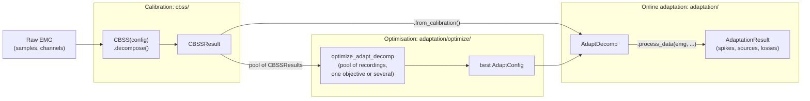

# adapt_decomp

Adaptive decomposition of high-density electromyography (EMG) into motor-unit firings during
dynamic contractions, in real time (about 22 ms per 100 ms batch on a CPU), based on online
learning metrics with tunable hyperparameters, as described in
[Mendez Guerra et al., J. Neural Eng., 2024](https://dx.doi.org/10.1088/1741-2552/ad5ebf).
It is implemented in Python with PyTorch.



## Where to start

- **New here:** [Getting started](getting-started.md) installs the package and runs the whole
  pipeline on one recording.
- **Have raw EMG, need motor units:** [Calibration](calibration.md), or the
  [Calibrate a recording](how-to/calibrate-a-recording.md) recipe.
- **Have a calibration, need an online decomposition:** [Adaptation](adaptation.md).
- **Need hyperparameters for your data:** [Optimisation](optimisation.md) and
  [Tune hyperparameters](how-to/tune-hyperparameters.md).
- **Want the map of the code first:** [Architecture](architecture.md).
- **Want to know what to expect:** the [FDSI benchmark](benchmarks/fdsi.md) and its
  [results](benchmarks/fdsi/report.ipynb).
- **Looking for a function:** the [API reference](reference/index.md).

## Citation

If you use this code in your research, please cite:

```bibtex
@article{MendezGuerra2024,
  author    = {Mendez Guerra, Irene and Barsakcioglu, Deren Y. and Farina, Dario},
  title     = {Adaptive EMG decomposition in dynamic conditions based on online learning
               metrics with tunable hyperparameters},
  journal   = {Journal of Neural Engineering},
  publisher = {IOP Publishing},
  volume    = {21},
  number    = {4},
  year      = {2024},
  issn      = {1741-2552},
  doi       = {10.1088/1741-2552/ad5ebf},
  url       = {https://dx.doi.org/10.1088/1741-2552/ad5ebf}
}
```

Released under the MIT licence. Contact: Irene Mendez Guerra
(irene.mendez17@imperial.ac.uk).
