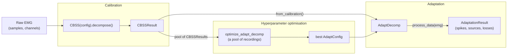

# adapt_decomp

--8<-- "README.md:overview"

## Where to start

- **[Installation](getting-started/installation.md)** and the
  **[Quickstart](getting-started/quickstart.md)**: install the package, download a 70 MB
  example recording and run the whole pipeline on it in a few minutes.
- **[Tutorial](notebooks/original_tutorial/adaptive_emg_decomp_dyn_example.ipynb)**: adaptation in
  depth on the simulated contraction of the paper, with and without adaptation, online and
  offline.
- **[User guide](guide/overview.md)**: how calibration, adaptation and hyperparameter
  optimisation work, and which parameters to set.
- **[How-to guides](how-to/index.md)**: short recipes for one task each.
- **[FDSI benchmark](benchmarks/fdsi.md)**: what to expect, on 100 recordings with ground truth.
- **[API reference](reference/index.md)**: every public class and function, with all its
  parameters.

## Citation

--8<-- "README.md:citation"

Released under the MIT licence. Contact: Irene Mendez Guerra (irene.mendez17@imperial.ac.uk).
