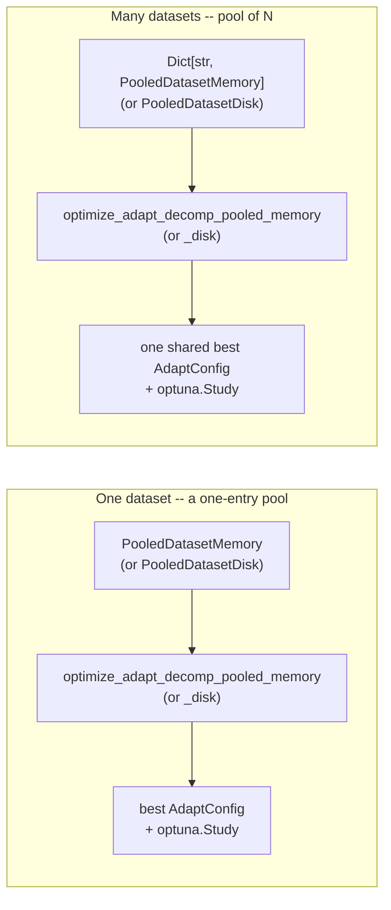
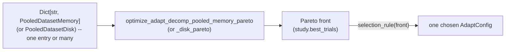

# Optimisation (`adaptation/optimize.py`)

Optuna-based hyperparameter search for `AdaptConfig` fields (typically
`wh_learning_rate`/`sv_learning_rate`). Two search modes share the same
pooled-dataset machinery — **a single dataset is just a one-entry pool**
either way:

- **Single-objective** — `optimize_adapt_decomp_pooled_memory` (plus its
  lazy, on-disk counterpart `optimize_adapt_decomp_pooled_disk`) scores
  every trial on one scalar, `objective`. Covered first, below.
- **Pareto / multi-objective** — `optimize_adapt_decomp_pooled_memory_pareto`/
  `optimize_adapt_decomp_pooled_disk_pareto` score every trial jointly on two
  or more scalars and return a front of trials instead of one winner. See
  [Pareto / multi-objective search](#pareto--multi-objective-search) below.

All four build a **fresh** `AdaptDecomp` per trial per dataset via
`_run_one_dataset`, the shared per-dataset runner.

Three guarded per-run scalars are computed once, at the end of
`AdaptDecomp.process_data()`, by `AdaptDecomp._compute_losses()`: `wh_loss_total`
(`median(wh_loss)` across batches), `sv_loss_total` (`sv_loss` summed across
units within a batch, then medianed across batches), and `total_loss` (their
sum) — all NaN- and trace-ratio-guarded against divergence (`1e10` sentinel).
Every trial logs all three per dataset and
pooled (summed across the pool), and `objective`
(`"sv_loss"`/`"wh_loss"`/`"total_loss"`/`"roa"`, default `"sv_loss"`)
picks which one the study is actually scored on. `study.optimize` always runs
under `direction="minimize"`, so the fourth value, `"roa"`, is expressed on
the same lower-is-better scale as the other three: `100 - roa_mean` (0 =
perfect agreement, 100 = none), guarded to `1e10` the same way whenever the
run itself diverged or `roa_mean` came out NaN. `objective="roa"` scores a
trial directly against ground truth rather than against either training
loss, which makes it useful for investigating the upper limit of achievable
performance (how good a config could be, if you could see ground truth) —
it implies `compute_roa=True` (no need to pass both) and, like
`compute_roa=True` on its own, requires every dataset in the pool to carry
ground truth (`gt_paired_bin`). `roa_mean`/`roa_per_unit` (the raw 0–100
diagnostic values) stay unguarded regardless of which `objective` is
selected; only the objective-scale `"roa"` key gets the divergence override.
For a pool, the objective is the **sum** of per-dataset losses (a config
that diverges on even one dataset should dominate and be rejected) —
`"roa_mean"` at the top level is a separate diagnostic, the *mean* of
per-dataset `roa_mean` values, not the same thing as the pooled `"roa"` sum;
the two won't numerically correspond.

`"sv_loss"` is the recommended default for single-objective search: summed
into `"total_loss"`, `wh_loss` empirically overpowers `sv_loss` (see
[Pareto / multi-objective search](#pareto--multi-objective-search) below),
so scoring on `total_loss` mostly ends up scoring on `wh_loss` alone.



## Programmatic usage

### One dataset

Build a single `PooledDatasetMemory` around an existing calibration (see
[calibration.md](calibration.md) for producing `calibration`/`cbss_config` in
the first place) and pass a one-entry `pool`:

```python
from adapt_decomp.adaptation.config import AdaptConfig
from adapt_decomp.adaptation.optimize import optimize_adapt_decomp_pooled_memory, DEFAULT_PARAM_SPACE
from adapt_decomp.utils.loaders import PooledDatasetMemory

pool = {
    "my-recording": PooledDatasetMemory(
        emg=emg, calibration=calibration, cbss_config=cbss_config,
        preprocess=True, gt_paired_bin=gt_paired_bin,   # gt_paired_bin optional
    ),
}
best_config, study = optimize_adapt_decomp_pooled_memory(
    pool=pool,
    param_space=DEFAULT_PARAM_SPACE,   # {"wh_learning_rate": ("log_float", 1e-4, 5e-2), ...}
    n_trials=50,
    base_config=AdaptConfig(ext_fact=cbss_config.ext_fact),
    compute_roa=True,                  # requires every dataset's gt_paired_bin
)
print(best_config.wh_learning_rate, study.best_value)
```

To score trials on RoA against ground truth instead (only meaningful in
simulation, where ground truth exists at all), pass `objective="roa"`. Since
this scores directly against ground truth rather than against a training
loss `sv_loss`/`wh_loss` only approximates, it is mainly useful to
investigate the upper limit of performance a config could reach, not as an
everyday objective (ground truth isn't available outside simulation):

```python
best_config, study = optimize_adapt_decomp_pooled_memory(
    pool=pool, param_space=DEFAULT_PARAM_SPACE, objective="roa",   # compute_roa=True implied
)
print(100 - study.best_value, "% RoA")   # study.best_value is the inverted loss, not raw RoA
```

Or run the runnable version of the snippet above via
`scripts/run_example.sh`/`scripts/sweep_optuna_example.sh` (see
[Command-line usage](#command-line-usage) below).

To extend the search space beyond the defaults:

```python
param_space = {**DEFAULT_PARAM_SPACE, "batch_ms": ("int", 50, 200)}
```

Kinds: `"log_float"`/`"float"`/`"int"` take `(kind, low, high)`;
`"categorical"` takes `(kind, choices)`.

### Pooled datasets

Identical call, more pool entries — nothing else changes:

```python
pool = {
    "triangular-ramp40s": PooledDatasetMemory(
        emg=emg_1, calibration=calib_1, cbss_config=cbss_config_1, gt_paired_bin=gt_1,
    ),
    "triangular-ramp10s": PooledDatasetMemory(
        emg=emg_2, calibration=calib_2, cbss_config=cbss_config_2, gt_paired_bin=gt_2,
    ),
}
best_config, study = optimize_adapt_decomp_pooled_memory(
    pool=pool, param_space=DEFAULT_PARAM_SPACE, n_trials=50,
    base_config=AdaptConfig(ext_fact=cbss_config_1.ext_fact), compute_roa=True,
)
```

Each dataset's own `cbss_config` wins over `base_config`'s shared fields
(`ext_fact`, `ext_mode`, `spike_det_exp`, preprocessing/filter fields) on
disagreement, reconciled fresh every trial inside `from_calibration()` — see
[architecture.md](architecture.md).

### Loading a pool from a data_config YAML

`load_data`/`load_pooled_cbss_memory` build `pool` directly from a
`datasets:` list, one entry or several — see
[configs/data_configs/fdsi_pool_memory_example.yaml](../configs/data_configs/fdsi_pool_memory_example.yaml):

```yaml
loader: 'load_pooled_cbss_memory'
root: 'path/to/dataset'
preprocess: true
datasets:
  - name: triangular-ramp40s
    path_emg: 'data/sub-01/noisy/..._emg.npz'
    path_calib: 'calibration/sub-01/..._cbss.pkl'
    path_calib_config: 'calibration/sub-01/..._cbss_config.yaml'
    path_gt: 'data/sub-01/clean/..._spikes.npz'   # optional -- omit for no RoA
  - name: triangular-ramp10s
    path_emg: '...'
    path_calib: '...'
    path_calib_config: '...'
```

```python
from adapt_decomp.adaptation.config import load_yaml
from adapt_decomp.utils import load_data

pool = load_data(load_yaml("configs/data_configs/fdsi_pool_memory_example.yaml"))
best_config, study = optimize_adapt_decomp_pooled_memory(pool=pool, param_space=DEFAULT_PARAM_SPACE, n_trials=50)
```

Ground truth, when `path_gt` is set, is matched to each dataset's calibration
via `CBSSResult.select_supervised()` — the calibration (and therefore the
resulting `PooledDatasetMemory`) is narrowed to only the matched units.

`load_pooled_cbss_memory` preloads and holds every dataset's calibration
resident in memory for the whole search. For a pool too large to hold in
memory at once (many datasets × long recordings), use
`optimize_adapt_decomp_pooled_disk` with `load_pooled_cbss_disk` instead — it
takes the identical `datasets:` YAML shape (`loader: load_pooled_cbss_disk`)
but returns `Dict[str, PooledDatasetDisk]` (paths and loader names, not
loaded data), loading and discarding each dataset fresh, per trial:

```python
from adapt_decomp.adaptation.optimize import optimize_adapt_decomp_pooled_disk

pool = load_data(load_yaml("configs/data_configs/fdsi_pool_disk_example.yaml"))
best_config, study = optimize_adapt_decomp_pooled_disk(pool=pool, param_space=DEFAULT_PARAM_SPACE, n_trials=50)
```

Both functions share the identical `param_space`/`objective`/`n_trials`/
`n_jobs`/`random_seed`/`compute_roa`/`roa_kwargs`/`best_result_path`/
`on_trial` keyword arguments — `_disk` trades a slower per-trial I/O cost for
a flat, small memory footprint regardless of pool size.

### Running trials concurrently

`n_jobs` (default `1`) is passed straight to Optuna's own `study.optimize()`
— set it above 1 to run multiple trials concurrently (thread-based). Exact
reproducibility from `random_seed` only holds at `n_jobs=1`; above that,
`TPESampler`'s suggestions depend on which other trials have already
reported, which is timing-dependent.

### Persisting the winning trial

Pass `best_result_path` to write the improving trial's result(s), resolved
config, and the completed study to disk as they're found:

```python
outputs, best_config, study = optimize_adapt_decomp_pooled_memory(
    pool=pool, param_space=DEFAULT_PARAM_SPACE, best_result_path="runs/best",
)
```

- One `<dataset>.pkl` (an `AdaptationResult`) per pool entry — one dataset or
  many alike.
- `config.yaml` (`AdaptConfig.to_yaml()`) and `study.pkl`.

Without `best_result_path`, both functions return just `(best_config, study)`.
Each `<dataset>.pkl` is a plain saved `AdaptationResult` — see
[adaptation.md](adaptation.md#running-and-reading-the-output) for how to
reload one.

### Watching trials as they run

`on_trial` is called once per completed trial with a canonical log dict:

```python
{
    "trial_number": int, "loss": float, "objective": str,
    "sv_loss": float, "wh_loss": float, "total_loss": float,   # pooled sums
    "params": dict,
    "per_dataset": {name: {"loss": float, "sv_loss": float, "wh_loss": float,
                            "total_loss": float,
                            "roa": float, "roa_mean": float,          # if compute_roa
                            "roa_per_unit": list[float]}},            # if compute_roa
    "roa": float, "roa_mean": float,   # pooled sum / mean-of-means, if compute_roa
}
```

`loss` is whichever of `sv_loss`/`wh_loss`/`total_loss`/`roa` `objective`
selects; `sv_loss`/`wh_loss`/`total_loss` are always present; `roa`/`roa_mean`
are present whenever `compute_roa` ends up `True`. `per_dataset` holds each
dataset's own values, one entry even for a one-entry pool. Use it to stream
to wandb/mlflow/print without this module depending on a specific tracker:

```python
optimize_adapt_decomp_pooled_memory(
    ..., on_trial=lambda log: print(log["trial_number"], log["loss"]),
)
```

## Pareto / multi-objective search

`optimize_adapt_decomp_pooled_memory_pareto` and its on-disk counterpart
`optimize_adapt_decomp_pooled_disk_pareto` score every trial jointly on two
or more scalars instead of collapsing them into one `objective`. The point
is to optimise `wh_loss` and `sv_loss` *concurrently but separately* — each
its own axis of the front — rather than pre-summing them into one
`total_loss` scalar. That summed rescaling is exactly what the
single-objective search above avoids by defaulting to `objective="sv_loss"`:
empirically, `wh_loss` overpowers `sv_loss` inside `total_loss`, so a
`total_loss`-scored search mostly just optimises `wh_loss`. Scoring on
`sv_loss` alone sidesteps that, but at the cost of ignoring `wh_loss`
entirely. The Pareto front recovers that: it optimises `sv_loss` without
letting `wh_loss` dominate, but still keeps `wh_loss` in view as its own
objective, so a trial that improves `sv_loss` at a large `wh_loss` cost
is only preferred over one that doesn't when it actually dominates on both.
Reach for it instead of the single-objective search above when no fixed
rescaling of `wh_loss`/`sv_loss` into `total_loss` tracks what you actually
care about — empirically, no such rescaling beat `sv_loss` alone, and a
retrospective Pareto front over already-run single-objective studies' trials
contained meaningfully better-RoA trials than the single-scalar search had
settled on (see
`notebooks/muniverse_simulations/fdsi_33_loss_roa_correlation_silent_window_confound.ipynb`).



Same pool/`param_space`/`base_config`/`compute_roa`/`roa_kwargs`/`n_trials`/
`n_jobs`/`sampler`/`random_seed`/`best_result_path`/`on_trial` arguments as
`optimize_adapt_decomp_pooled_memory`, plus two differences:

```python
from adapt_decomp.adaptation.optimize import (
    optimize_adapt_decomp_pooled_memory_pareto, DEFAULT_OBJECTIVES,
    _select_min_sv_loss, _select_max_roa_mean,
)

best_config, pareto_front, study = optimize_adapt_decomp_pooled_memory_pareto(
    pool=pool,
    param_space=DEFAULT_PARAM_SPACE,
    objectives=DEFAULT_OBJECTIVES,   # ("wh_loss", "sv_loss"); any 2+ ObjectiveNames, no duplicates
    n_trials=100,
    compute_roa=True,                # optional; "roa" need not be in objectives to log it
)
```

- **`objectives`** (instead of `objective`) — a tuple of two or more
  `"sv_loss"`/`"wh_loss"`/`"total_loss"`/`"roa"` names, no duplicates.
  Defaults to `DEFAULT_OBJECTIVES = ("wh_loss", "sv_loss")`. Each is pooled
  the same **sum**-across-the-pool way as the single-objective search's
  `objective`; `"roa"` in `objectives` implies `compute_roa=True`, same as
  `objective="roa"` does above.
- The study runs under `optuna.create_study(directions=[...])`
  (one `"minimize"` per entry in `objectives`) instead of a single scalar
  `direction`. `study.best_value`/`study.best_params` raise `RuntimeError`
  on a multi-objective study — read back via `study.best_trials` (the Pareto
  front, a `List[optuna.trial.FrozenTrial]`) instead, returned directly as
  `pareto_front`.

`selection_rule` picks one trial off the front to build `best_config` from
(the front itself has no single "winner"):

- **`_select_min_sv_loss`** (the default) — the front's own minimum pooled
  `sv_loss` member. Always Pareto-optimal by construction and needs no
  ground truth.
- **`_select_max_roa_mean`** — the front's own highest mean-RoA member.
  Needs `compute_roa=True` (or `"roa"` in `objectives`) for the search that
  produced `pareto_front`; otherwise every member's RoA is absent and it
  falls back to picking arbitrarily.
- Pass your own `Callable[[List[FrozenTrial]], FrozenTrial]` for any other
  rule (e.g. picking off `study.best_trials` by hand and reading each
  trial's `user_attrs`).

```python
best_config, pareto_front, study = optimize_adapt_decomp_pooled_memory_pareto(
    pool=pool, param_space=DEFAULT_PARAM_SPACE, objectives=("sv_loss", "roa"),
    compute_roa=True, selection_rule=_select_max_roa_mean,
)
```

**`best_result_path`**, when set, writes every current front member to its
own subdirectory — `<best_result_path>/trial_<trial_number>/` (one
`<dataset>.pkl` per pool entry plus `config.yaml`) — evicted (subdirectory
deleted) the moment a later trial dominates it, and snapshots `study.pkl`
after **every** trial, not only once the search finishes, so an interrupted
run's on-disk state always reflects every trial completed so far. With it
set, the return becomes `(best_outputs, best_config, pareto_front, study)`,
`best_outputs` mapping dataset name to `selection_rule`'s chosen trial's
`AdaptationResult`. `optimize_adapt_decomp_pooled_disk_pareto` mirrors
`optimize_adapt_decomp_pooled_disk`'s memory-lean trade-off the same way —
scratch files staged through `<best_result_path>_temp` per trial, promoted
into a front member's subdirectory only when it joins the front, and never
returning `AdaptationResult`s in memory (reload from
`best_result_path` instead).

`on_trial`'s log dict differs from the single-objective form — there is no
single `"loss"` key, since no single scalar was scored:

```python
{
    "trial_number": int, "objectives": tuple[str, ...], "values": tuple[float, ...],
    "sv_loss": float, "wh_loss": float, "total_loss": float,   # pooled sums, always present
    "params": dict,
    "per_dataset": 
      {name: 
        {
          "sv_loss": float,
          "wh_loss": float,
          "total_loss": float,
          "roa": float,
          "roa_mean": float,          # if compute_roa
          "roa_per_unit": list[float] # if compute_roa
        }
      },            
    "on_front": bool,                   # only when best_result_path is set
    "roa": float, "roa_mean": float,    # pooled sum / mean-of-means, if compute_roa
}
```

**No CLI support yet** — `scripts/run.py`'s `run_optuna` only drives the
single-objective search. Use Pareto search programmatically, importing
directly from `adapt_decomp.adaptation.optimize` (it isn't re-exported from
`adapt_decomp.adaptation`/top-level `adapt_decomp` alongside the
single-objective functions):

```python
from adapt_decomp.adaptation.optimize import optimize_adapt_decomp_pooled_memory_pareto
```

## Reproducibility

`random_seed` (default `1909`) seeds only the default
`TPESampler(n_startup_trials=15, seed=random_seed)` — the order Optuna
proposes hyperparameters in. It has no effect if you pass your own
`sampler=`; seed that sampler yourself if you need its proposals to
reproduce too. `pool` entries are already-built `CBSSResult`s, never
re-decomposed here, so `random_seed` never has to account for calibration's
own ICA randomness — that's calibration's own concern, see
[calibration.md#reproducibility](calibration.md#reproducibility) — and each
trial's `AdaptDecomp` run is otherwise deterministic per
[adaptation.md#reproducibility](adaptation.md#reproducibility).

As already noted in
[Running trials concurrently](#running-trials-concurrently), exact
reproducibility from `random_seed` only holds at `n_jobs=1` — above that,
`TPESampler`'s next suggestion depends on which other trials have already
reported, which is timing-dependent, so trial order (and therefore
`study.best_trials`/`study.best_value`) can differ between two runs of the
same `n_trials`/`random_seed` even with everything else fixed.

`best_result_path`'s `config.yaml`/`study.pkl` capture the winning config
and the completed study, but not the `random_seed`/`param_space`/
`objective`/`objectives` that produced them. Keep whatever produced a search
(the `--optim_config` file, or the call-site arguments) alongside its
`best_result_path` output if you need to rerun it later — the same way a
calibration's `CBSSConfig` needs to be saved alongside it, not just the
`CBSSResult` itself (see
[calibration.md#reproducibility](calibration.md#reproducibility)).

## Command-line usage

`scripts/run.py` is a `typer` CLI with three subcommands — `run` (a single
plain decomposition pass, no search), `run_optuna` (this page's Optuna
search), and `run_wandb` (a wandb-managed sweep, covered below for how its
wandb output differs from `run_optuna`'s). All three take `--adapt_config`/
`--data_config` (paths to an `AdaptConfig` YAML and a `configs/data_configs/`
YAML) and an optional `--wandb_project_name`.

### `run_optuna` — Optuna search

```sh
python scripts/run.py run_optuna \
  --adapt_config configs/adapt_configs/default_muniverse_lrfixed.yaml \
  --data_config configs/data_configs/fdsi_pool_memory_example.yaml \
  --optim_config configs/sweep_configs/sweep_optuna.yaml \
  --objective sv_loss
```
(runnable as-is via `scripts/sweep_optuna_example.sh`). `--data_config` can
point at either a `load_pooled_cbss_memory` data_config (one dataset or many,
per [Loading a pool from a data_config YAML](#loading-a-pool-from-a-data_config-yaml)
above) or the legacy `load_example` format — both are wrapped into a pool
internally, so `run_optuna` never needs to know which.

`--optim_config` points at a YAML holding `param_space` plus the rest of
`optimize_adapt_decomp_pooled_memory`'s *search-strategy* arguments —
reusable across datasets/runs, unlike `best_result_path`/`compute_roa`/
`roa_kwargs`, which are run-specific and only reachable by calling
`optimize_adapt_decomp_pooled_memory`/`_run_optuna()` directly (no CLI flag
for those two) — see
[configs/sweep_configs/sweep_optuna.yaml](../configs/sweep_configs/sweep_optuna.yaml):

```yaml
param_space:
  wh_learning_rate: ["log_float", 1.0e-4, 5.0e-2]
  sv_learning_rate: ["log_float", 1.0e-4, 1.0e-1]
objective: "sv_loss"   # "sv_loss" | "wh_loss" | "total_loss" | "roa"
n_trials: 100
n_jobs: 1
random_seed: 1909
```

`--objective`/`--n_trials`/`--best_result_path` on the command line override
the file's own values for that one invocation; omitted, they fall back to
the file's value, then to `optimize_adapt_decomp_pooled_memory`'s own
defaults (`"sv_loss"`/`100`/`None`).

Every trial is logged live to the active wandb run under an `optuna/`-
prefixed key (`optuna/loss`, `optuna/param_*`, `optuna/roa_mean` when ground
truth is available), alongside a `best_config` summary once the search
finishes. Pass `--best_result_path <dir>` to also persist the winning
trial's results (see [Persisting the winning trial](#persisting-the-winning-trial)).

### `run_wandb` — wandb-managed sweep

```sh
python scripts/run.py run_wandb \
  --adapt_config configs/adapt_configs/default_muniverse_lrfixed.yaml \
  --data_config configs/data_configs/fdsi_pool_memory_example.yaml \
  --sweep_config configs/sweep_configs/sweep_wandb.yaml
```
(runnable as-is via `scripts/sweep_wandb_example.sh`). `--sweep_config` is a
plain [wandb sweep config](https://docs.wandb.ai/guides/sweeps/define-sweep-configuration)
(`method`/`metric`/`parameters`), plus one custom key this repo adds,
`sweep_counts` (the number of sweep iterations to run — popped out before the
rest of the file is handed to `wandb.sweep()`, which doesn't know it), also
overridable via `--sweep_counts` — see
[configs/sweep_configs/sweep_wandb.yaml](../configs/sweep_configs/sweep_wandb.yaml).
Each sweep iteration is a **plain** run (`run`'s own code path) with
hyperparameters chosen by wandb itself — there is no nested Optuna search
inside a wandb sweep, by design.

### `run_optuna` vs `run_wandb`: why the wandb output looks different

These are two independent search mechanisms, and their wandb footprints
reflect that rather than being unified:

- **Run count.** `run_wandb` gives you `sweep_counts` separate wandb runs
  (wandb's native sweep tooling — parallel coordinates, the sweep table —
  compares across them). `run_optuna` runs its whole study inside **one**
  wandb run; wandb's sweep-specific views don't apply to it at all.
- **Key names.** `run_wandb` logs bare, per-dataset/pooled keys (`sv_loss`,
  `{name}/sv_loss`, ...). `run_optuna` logs an `optuna/`-prefixed namespace
  (`optuna/sv_loss`, ...) — the same underlying quantity lands under a
  different key depending on which path produced it.
- **x-axis meaning.** `run_wandb` logs a full per-batch time series for
  every iteration (one point per adaptation batch). `run_optuna` logs one
  point per completed *trial* — a non-winning trial's own per-batch
  trajectory is never logged at all, only its final scalar loss.
- **Per-dataset/RoA summaries.** `run_wandb` always logs them (via
  `_log_pooled_outputs`). `run_optuna` only does, for the single winning
  trial, when `--best_result_path` is set.

## Which one should I use?

| | `run_optuna` | `run_wandb` |
|---|---|---|
| Search algorithm | Optuna (TPE by default) | wandb (random/grid/Bayesian) |
| wandb account needed | No (logging is optional) | Yes |
| wandb runs produced | 1 (whole study) | 1 per sweep iteration |
| Per-batch traces logged | Winning trial only, if `--best_result_path` set | Every iteration |
| Nested search | N/A | Never (each iteration is a plain run) |

Neither CLI path scores more than one objective at a time. If a single
rescaled `total_loss` (or `sv_loss`/`wh_loss`/`roa` alone) doesn't capture
the trade-off you care about, use the
[Pareto / multi-objective search](#pareto--multi-objective-search) above
instead — programmatic only, no CLI support yet.
