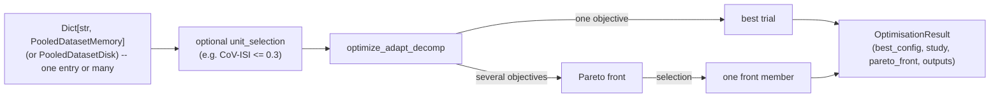

# Optimisation (`adaptation/optimize/`)

Optuna-based hyperparameter search for `AdaptConfig` fields (by default
`wh_learning_rate`, `sv_learning_rate` and `centroid_momentum`). One entry
point, `optimize_adapt_decomp`, covers every mode — **a single dataset is
just a one-entry pool**:

- **Single-objective vs Pareto** — chosen by `objectives`: one name scores
  every trial on that scalar; two or more score it jointly and return a front
  of trials, from which `selection` picks one. See
  [Pareto / multi-objective search](#pareto--multi-objective-search).
- **In memory vs on disk** — chosen by the pool's entries:
  `PooledDatasetMemory` (preloaded) or `PooledDatasetDisk` (loaded fresh per
  trial). See [Pooled datasets](#pooled-datasets).

Every trial builds a **fresh** `AdaptDecomp` per dataset, with one shared
parameter suggestion.

Three guarded per-run scalars are computed once, at the end of
`AdaptDecomp.process_data()`, by `AdaptDecomp._compute_losses()`: `wh_loss_total`
(`median(wh_loss)` across batches), `sv_loss_total` (`sv_loss` reduced across
units within a batch, then medianed across batches; see
[Pooling losses across datasets](#pooling-losses-across-datasets)), and
`total_loss` (their sum) — all NaN- and trace-ratio-guarded against
divergence (`1e10` sentinel). Every trial logs all three per dataset and
pooled (summed across the pool); `objectives`
(`"sv_loss"`/`"wh_loss"`/`"total_loss"`/`"roa"`, default `"sv_loss"`) picks
which the study is actually scored on. Studies always minimise, so `"roa"` is
expressed on the same lower-is-better scale: `100 - roa_mean` (0 = perfect
agreement), guarded to `1e10` whenever the run diverged or `roa_mean` came out
NaN. Scoring on `"roa"` scores a trial directly against ground truth, which
makes it useful to investigate the upper limit of achievable performance; it
implies `compute_roa=True` and, like `compute_roa=True` on its own, requires
every dataset in the pool to carry ground truth. `roa_mean`/`roa_per_unit`
(the raw 0–100 diagnostics) stay unguarded. The top-level `"roa_mean"` is the
*mean* of per-dataset `roa_mean` values, a separate diagnostic from the pooled
`"roa"` sum.

`"sv_loss"` is the recommended single objective: summed into `"total_loss"`,
`wh_loss` empirically overpowers `sv_loss`, so scoring on `total_loss` mostly
ends up scoring on `wh_loss` alone.


```mermaid
flowchart LR
    D["Dict[str, PooledDatasetMemory]\n(or PooledDatasetDisk) -- one entry or many"] --> S["optional unit_selection\n(e.g. CoV-ISI <= 0.3)"]
    S --> O["optimize_adapt_decomp"]
    O -->|"one objective"| R1["best trial"]
    O -->|"several objectives"| F["Pareto front"]
    F -->|"selection"| R2["one front member"]
    R1 --> B["OptimisationResult\n(best_config, study, pareto_front, outputs)"]
    R2 --> B
```

## Programmatic usage

### One dataset

Build a single `PooledDatasetMemory` around an existing calibration (see
[calibration.md](calibration.md) for producing `calibration`/`cbss_config`)
and pass a one-entry `pool`:

```python
from adapt_decomp.adaptation import AdaptConfig, optimize_adapt_decomp
from adapt_decomp.utils.loaders import PooledDatasetMemory

pool = {
    "my-recording": PooledDatasetMemory(
        emg=emg,
        calibration=calibration,
        cbss_config=cbss_config,
        preprocess=True,
        gt_paired_bin=gt_paired_bin,  # optional
    ),
}
result = optimize_adapt_decomp(
    pool=pool,
    n_trials=50,
    base_config=AdaptConfig(ext_fact=cbss_config.ext_fact),
    compute_roa=True,  # requires every dataset's ground truth
    # no ground truth: drop compute_roa and pass unit_selection="unsupervised"
    # (see Unit selection below)
)
print(result.best_config.wh_learning_rate, result.study.best_value)
```

`result` is an `OptimisationResult`: `best_config` (the base config with the
chosen trial's parameters), `study`, `pareto_front` (Pareto search only) and
`outputs` (see [Persisting the chosen trial](#persisting-the-chosen-trial)).

To score trials on RoA against ground truth instead (only meaningful in
simulation, where ground truth exists), pass `objectives="roa"`:

```python
result = optimize_adapt_decomp(pool=pool, objectives="roa")  # compute_roa=True implied
print(100 - result.study.best_value, "% RoA")  # best_value is the inverted loss
```

`param_space` defaults to `DEFAULT_PARAM_SPACE`:

```python
{
    "wh_learning_rate": ("log_float", 1e-4, 5e-2),
    "sv_learning_rate": ("log_float", 1e-4, 1e-1),
    "centroid_momentum": ("float", 0.0, 0.95),
}
```

To extend it: `param_space={**DEFAULT_PARAM_SPACE, "batch_ms": ("int", 50, 200)}`.
Kinds: `"log_float"`/`"float"`/`"int"` take `(kind, low, high)`;
`"categorical"` takes `(kind, choices)`. Ordered values such as
`centroid_momentum` are better searched as `"float"` than as a categorical
grid, since TPE can then model their order.

### Pooled datasets

Identical call, more pool entries:

```python
pool = {
    "triangular-ramp40s": PooledDatasetMemory(emg=emg_1, calibration=calib_1, cbss_config=cfg_1),
    "triangular-ramp10s": PooledDatasetMemory(emg=emg_2, calibration=calib_2, cbss_config=cfg_2),
}
result = optimize_adapt_decomp(pool=pool, n_trials=50)
```

Each dataset's own `cbss_config` wins over `base_config`'s shared fields
(`ext_fact`, `ext_mode`, `spike_det_exp`, preprocessing/filter fields) on
disagreement, reconciled fresh every trial inside `from_calibration()` — see
[architecture.md](architecture.md).

`load_data`/`load_pooled_cbss_memory` build `pool` directly from a
`datasets:` list, one entry or several — see
[configs/data_configs/fdsi_pool_memory_example.yaml](../configs/data_configs/fdsi_pool_memory_example.yaml):

```yaml
loader: 'load_pooled_cbss_memory'
root: 'path/to/dataset'
preprocess: true
datasets:
  - name: triangular-ramp40s
    path_emg: 'data/sub-01/noisy/..._emg.npz'
    path_calib: 'outputs/calibration/sub-01/..._cbss.pkl'
    path_calib_config: 'outputs/calibration/sub-01/..._cbss_config.yaml'
    path_gt: 'data/sub-01/clean/..._spikes.npz'   # optional -- omit for no RoA
```

```python
from adapt_decomp.adaptation.config import load_yaml
from adapt_decomp.utils import load_data

pool = load_data(load_yaml("configs/data_configs/fdsi_pool_memory_example.yaml"))
result = optimize_adapt_decomp(pool=pool, n_trials=50)
```

Ground truth, when `path_gt` is set, is matched to each dataset's calibration
via `CBSSResult.select_supervised()` — the calibration is narrowed to only the
matched units.

`load_pooled_cbss_memory` holds every dataset resident in memory for the
whole search. For a pool too large for that, use `load_pooled_cbss_disk`
(`loader: load_pooled_cbss_disk`, same `datasets:` shape): it returns
`PooledDatasetDisk` entries (paths, not data), which `optimize_adapt_decomp`
loads and discards per dataset per trial — a slower per-trial I/O cost for a
flat, small memory footprint. The call is unchanged.

### Unit selection

`unit_selection` (optional) sets which calibration units a search adapts and
scores, applied once per dataset before the first trial:

- **`None`** (default) — every unit.
- **`"unsupervised"`** — keeps the units passing
  `CBSSResult.unsupervised_mask(**unit_selection_kwargs)`, by default
  `{"cov_th": 0.3}`: regular firers, whose contrast is a reliable tracking
  signal. Dropped units are removed from the calibration, so they are not
  adapted either, and ground truth columns are dropped with them. A dataset
  left with no unit is left out of the pool with a warning.
- **`"supervised"`** — the ground-truth-matched units. Requires every
  dataset's ground truth; its loader already narrowed the calibration.

`"unsupervised"` is recommended for recordings without ground truth, where
the calibration's units can't be validated otherwise:

```python
# No ground truth: adapt and score only regularly firing units during the search
result = optimize_adapt_decomp(pool=pool, n_trials=50, unit_selection="unsupervised")
```

When the calibrations are already narrowed to ground-truth-matched units (as
in the FDSI benchmark, `CBSSResult.select_supervised(roa_th=0.9)`), leave it
at `None`.

The final run (e.g. `scripts/run.py run`) adapts every calibration unit; the
search only chooses parameters on the selected ones.

### Pooling losses across datasets

Each objective is the **sum** of its per-dataset values over the pool (a
config that diverges on even one dataset should dominate and be rejected).
Per dataset, `sv_loss` is reduced across units by
`AdaptConfig.sv_loss_reduction` (on the base config):

- **`"mean"`** (default) — per-unit mean, i.e. `sv_loss_total / M`. Every
  dataset then weighs the same in the pooled sum, whatever its unit count.
- **`"sum"`** — the 1.0.0 behaviour. A dataset's weight then grows with its
  number of units, biasing the search towards high-yield recordings.

Why this is enough: the per-unit errors (and `wh_loss`) are already z-scored
against each unit's/dataset's own calibration statistics, so per-unit-mean
`sv_loss` is dimensionless and comparable across datasets — no further
per-dataset normalisation is needed, and summing or averaging over the pool
gives the same optimum and the same Pareto front. Avoid rank-normalising
losses across trials: it makes the objective change as trials accumulate,
which corrupts TPE's history. If a few strongly drifting datasets still
dominate, summing log losses (a geometric mean) is the scale-invariant
fallback. Note that a unit with no spikes in a batch scores e² = 9 (the
−3 contrast-error fallback).

### Faster searches: `n_cores` and `n_jobs`

Two settings, with separate roles:

- **`n_jobs`** (default `1`) sets the search: how many trials the sampler
  suggests together, before it sees their results. The default sampler's 15
  random start-up trials are always suggested together, which changes
  nothing (they don't depend on results). `1` is the one-at-a-time search;
  above 1 is a batched search, and the default sampler adds `constant_liar` so
  a batch isn't sent to one region. With `random_seed`, `n_jobs` fixes the
  suggested parameters on any machine.
- **`n_cores`** (default: all physical cores this process may use, honouring
  CPU affinity, containers and SLURM) sets only the speed.
  `plan_resources` fills the cores with dataset runs first: up to
  `n_cores // len(pool)` trials at once, each over up to `len(pool)` worker
  processes holding their share of the pool; leftover cores become torch
  threads per run. A batch larger than the trials that fit runs in waves.

| Pool | Trials at once | Plan on 24 cores (trials x workers, threads each) |
|---|---|---|
| 3 datasets | 1 (`n_jobs=1`) | 1 x 3, 8 threads |
| 3 datasets | 15 (start-up) | 8 x 3, 1 thread |
| 12 datasets | 1 | 1 x 12, 2 threads |
| 50 datasets | any | 1 x 24, 1 thread (2-3 datasets per worker) |

Before any worker starts, the search predicts its peak memory from every
dataset's own shape (samples, channels, extension factor, units) and checks
it against the machine's or the job's limit. Over the limit it raises,
naming the largest `n_cores` that fits; over the memory currently free it
warns. A disk pool (`PooledDatasetDisk`) keeps nothing resident between
runs, which helps when the pool itself is large. `n_cores` above the cores
available, or more trials per batch than fit at once, raise or warn with
the same kind of guidance.

A search over the forward pass only (see
[adaptation.md](adaptation.md#adapting-from-the-end-of-the-calibration-window))
also halves the work per trial; apply the backward pass to the chosen config
only.

### Persisting the chosen trial

Pass `best_result_path` to write results to disk as they're found:

```python
result = optimize_adapt_decomp(pool=pool, best_result_path="runs/best")
result.outputs["triangular-ramp40s"]  # AdaptationResult of the chosen trial
```

- Each trial's per-dataset `AdaptationResult`s are staged in
  `<best_result_path>_temp` (deleted when the search finishes).
- Single-objective: an improving trial is promoted to `<dataset>.pkl` plus
  `config.yaml` in `best_result_path` itself.
- Pareto: each trial joining the front is promoted to
  `<best_result_path>/trial_<n>/`, deleted when a later trial dominates it.
- `study.pkl` is rewritten after **every** trial, so an interrupted search's
  on-disk state reflects every completed trial.

`result.outputs` holds the chosen trial's results for an in-memory pool; for
an on-disk pool it is `None` — reload with
`AdaptationResult.load(Path(best_result_path) / f"{name}.pkl")` (or
`.../trial_<n>/...`). See
[adaptation.md](adaptation.md#running-and-reading-the-output) for reading one.

### Watching trials as they run

`on_trial` is called once per completed trial with a log dict:

```python
{
    "trial_number": int,
    "params": dict,
    "loss": float,
    "objective": str,  # single-objective
    "objectives": tuple,
    "values": tuple,  # Pareto
    "sv_loss": float,
    "wh_loss": float,
    "total_loss": float,  # pooled sums
    "per_dataset": {
        name: {
            "sv_loss": float,
            "wh_loss": float,
            "total_loss": float,
            "loss": float,  # single-objective
            "roa": float,
            "roa_mean": float,
            "roa_per_unit": list[float],  # if compute_roa
        }
    },
    "roa": float,
    "roa_mean": float,  # pooled sum / mean-of-means, if compute_roa
    "on_front": bool,  # if best_result_path is set
}
```

Use it to stream to wandb/mlflow/print without this module depending on a
specific tracker: `on_trial=lambda log: print(log["trial_number"], log["sv_loss"])`.

## Pareto / multi-objective search

Pass two or more `objectives` to score every trial jointly instead of
collapsing them into one scalar:

```python
from adapt_decomp.adaptation.optimize import DEFAULT_OBJECTIVES  # ("wh_loss", "sv_loss")

result = optimize_adapt_decomp(pool=pool, objectives=DEFAULT_OBJECTIVES, selection="knee")
result.pareto_front  # study.best_trials
result.best_config  # built from the selected front member
```

The point is to optimise `wh_loss` and `sv_loss` *concurrently but
separately* — each its own axis of the front — rather than pre-summing them
into `total_loss`, where `wh_loss` dominates. Scoring on `sv_loss` alone
sidesteps that but ignores `wh_loss` entirely; the front keeps both in view,
so a trial that improves `sv_loss` at a large `wh_loss` cost is only preferred
when it dominates on both. Empirically, no rescaling of `wh_loss`/`sv_loss`
into `total_loss` beat `sv_loss` alone, and a retrospective front over
single-objective studies' trials contained meaningfully better-RoA trials
than the single-scalar search settled on (see
[`05_comparison_sv_loss_pareto_roa.ipynb`](../notebooks/fdsi_benchmark/05_comparison_sv_loss_pareto_roa.ipynb)).

The study runs under `directions=[...]`, one `"minimize"` per objective;
`study.best_value`/`study.best_params` raise `RuntimeError` on it — read
`result.pareto_front` instead. `selection` picks the front member that builds
`best_config`:

- **`"min_sv_loss"`** (default) — the front's minimum pooled `sv_loss`
  member. Always Pareto-optimal and needs no ground truth, but it sits at the
  front's extreme: it accepts large `wh_loss` costs for tiny `sv_loss` gains.
- **`"knee"`** — the knee of a two-objective front: both objectives are
  min-max normalised over the front, and the member farthest from the line
  through its two extremes is chosen — where improving one objective starts
  costing the most of the other. Needs no ground truth; requires exactly two
  objectives (falls back to `"min_sv_loss"` on fronts of one or two members).
- **`"max_roa_mean"`** — the front's highest mean-RoA member. Needs
  `compute_roa=True` (or `"roa"` in `objectives`).
- Any `Callable[[List[FrozenTrial]], FrozenTrial]` for another rule.

The named rules are also available as `SELECTION_RULES` (name → function), to
read a finished front with another rule without searching again:

```python
from adapt_decomp.adaptation.optimize import SELECTION_RULES

knee_trial = SELECTION_RULES["knee"](result.pareto_front)
```

## Sampler and reproducibility

The default sampler is a **multivariate** `TPESampler(n_startup_trials=15,
seed=random_seed)`: it models the parameters jointly, which matters because
they interact (the learning rates and `centroid_momentum` all set how fast
units are tracked). Pass `sampler=` to use another; `random_seed` (default
`1909`) only seeds the default one.

`pool` entries are already-built `CBSSResult`s, never re-decomposed here, so
`random_seed` never has to account for calibration's own ICA randomness (see
[calibration.md#reproducibility](calibration.md#reproducibility)), and each
trial's `AdaptDecomp` run is otherwise deterministic per
[adaptation.md#reproducibility](adaptation.md#reproducibility). The
suggested parameters depend only on `random_seed` and `n_jobs`, not on
`n_cores`. `n_cores` sets the torch threads per run, which can change the
last digits of the losses (and, rarely, which trial TPE ranks higher).

`best_result_path`'s `config.yaml`/`study.pkl` capture the chosen config and
the study, but not the search settings that produced them. Keep the
`--optim_config` file (or the call-site arguments) alongside its output, the
same way a calibration's `CBSSConfig` is saved alongside its `CBSSResult`.

## Deprecated entry points

`optimize_adapt_decomp_pooled_memory`, `optimize_adapt_decomp_pooled_disk`,
`optimize_adapt_decomp_pooled_memory_pareto` and
`optimize_adapt_decomp_pooled_disk_pareto` still work, with their 1.0.0
signatures and tuple return shapes, but warn with `FutureWarning`. They run
`optimize_adapt_decomp` with `unit_selection=None` (they never selected
units). Migrate by calling `optimize_adapt_decomp` with `objectives=` (the old
`objective`/`objectives`) and `selection=` (the old `selection_rule`), and
reading the returned `OptimisationResult`'s fields.

## Command-line usage

`scripts/run.py` is a `typer` CLI with three subcommands — `run` (a single
plain decomposition pass, no search), `run_optuna` (this page's Optuna
search), and `run_wandb` (a wandb-managed sweep, covered below for how its
wandb output differs from `run_optuna`'s). All three take `--adapt_config`/
`--data_config` (paths to an `AdaptConfig` YAML and a `configs/data_configs/`
YAML) and an optional `--wandb_project_name`.

### `run_optuna` — Optuna search

```sh
python scripts/run.py run_optuna \
  --adapt_config configs/adapt_configs/default_muniverse_lrfixed.yaml \
  --data_config configs/data_configs/fdsi_pool_memory_example.yaml \
  --optim_config configs/sweep_configs/sweep_optuna.yaml \
  --objective sv_loss
```
(runnable as-is via `scripts/sweep_optuna_example.sh`). `--data_config` can
point at either a `load_pooled_cbss_memory` data_config (one dataset or many)
or the legacy `load_example` format — both are wrapped into a pool
internally.

`--optim_config` points at a YAML holding `optimize_adapt_decomp`'s
*search-strategy* arguments — reusable across datasets/runs, unlike
`best_result_path`/`compute_roa`/`roa_kwargs`, which are run-specific — see
[configs/sweep_configs/sweep_optuna.yaml](../configs/sweep_configs/sweep_optuna.yaml):

```yaml
param_space:                       # omit to use DEFAULT_PARAM_SPACE
  wh_learning_rate: ["log_float", 1.0e-4, 5.0e-2]
  sv_learning_rate: ["log_float", 1.0e-4, 1.0e-1]
  centroid_momentum: ["float", 0.0, 0.95]
objectives: ["sv_loss"]            # one = single-objective; two or more = Pareto front
selection: "min_sv_loss"           # Pareto only: "min_sv_loss" | "knee" | "max_roa_mean"
unit_selection: null               # null = every unit | "unsupervised" (recommended without GT) | "supervised"
unit_selection_kwargs: {cov_th: 0.3}   # only used by "unsupervised"
n_trials: 100
n_jobs: 1
n_cores: null
random_seed: 1909
# sampler: {n_startup_trials: 30, multivariate: true}   # TPESampler kwargs
```

`--objective`/`--n_trials`/`--best_result_path` on the command line override
the file's own values for that one invocation. Every trial is logged live to
the active wandb run under an `optuna/`-prefixed key (`optuna/loss` or
`optuna/value_<objective>`, `optuna/param_*`, `optuna/roa_mean` when ground
truth is available), alongside a `best_config` summary once the search
finishes. Pass `--best_result_path <dir>` to also persist and log the chosen
trial's results.

### `run_wandb` — wandb-managed sweep

```sh
python scripts/run.py run_wandb \
  --adapt_config configs/adapt_configs/default_muniverse_lrfixed.yaml \
  --data_config configs/data_configs/fdsi_pool_memory_example.yaml \
  --sweep_config configs/sweep_configs/sweep_wandb.yaml
```
(runnable as-is via `scripts/sweep_wandb_example.sh`). `--sweep_config` is a
plain [wandb sweep config](https://docs.wandb.ai/guides/sweeps/define-sweep-configuration)
(`method`/`metric`/`parameters`), plus one custom key this repo adds,
`sweep_counts` (the number of sweep iterations to run — popped out before the
rest of the file is handed to `wandb.sweep()`, which doesn't know it), also
overridable via `--sweep_counts` — see
[configs/sweep_configs/sweep_wandb.yaml](../configs/sweep_configs/sweep_wandb.yaml).
Each sweep iteration is a **plain** run (`run`'s own code path) with
hyperparameters chosen by wandb itself — there is no nested Optuna search
inside a wandb sweep, by design.

### `run_optuna` vs `run_wandb`: why the wandb output looks different

These are two independent search mechanisms, and their wandb footprints
reflect that rather than being unified:

- **Run count.** `run_wandb` gives you `sweep_counts` separate wandb runs
  (wandb's native sweep tooling — parallel coordinates, the sweep table —
  compares across them). `run_optuna` runs its whole study inside **one**
  wandb run; wandb's sweep-specific views don't apply to it at all.
- **Key names.** `run_wandb` logs bare, per-dataset/pooled keys (`sv_loss`,
  `{name}/sv_loss`, ...). `run_optuna` logs an `optuna/`-prefixed namespace
  (`optuna/sv_loss`, ...) — the same underlying quantity lands under a
  different key depending on which path produced it.
- **x-axis meaning.** `run_wandb` logs a full per-batch time series for
  every iteration (one point per adaptation batch). `run_optuna` logs one
  point per completed *trial* — a non-chosen trial's own per-batch
  trajectory is never logged at all, only its final scalar losses.
- **Per-dataset/RoA summaries.** `run_wandb` always logs them (via
  `_log_pooled_outputs`). `run_optuna` only does, for the chosen trial, when
  `--best_result_path` is set.

## Which one should I use?

| | `run_optuna` | `run_wandb` |
|---|---|---|
| Search algorithm | Optuna (multivariate TPE by default) | wandb (random/grid/Bayesian) |
| Objectives | One, or a Pareto front of several | One wandb metric |
| wandb account needed | No (logging is optional) | Yes |
| wandb runs produced | 1 (whole study) | 1 per sweep iteration |
| Per-batch traces logged | Chosen trial only, if `--best_result_path` set | Every iteration |
| Nested search | N/A | Never (each iteration is a plain run) |
